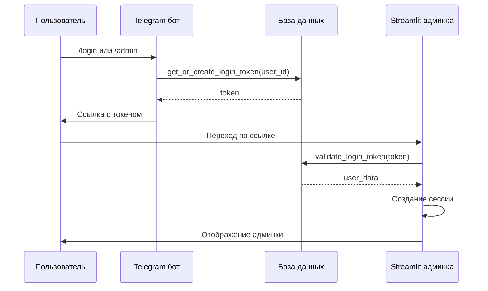

# 📋 Как работает авторизация в GrantService

## 📁 Проекты
- **GrantService**: `/var/GrantService` - основной проект с Telegram ботом и Streamlit админкой
- **datingapp**: `/var/datingapp` - проект-пример с готовой системой авторизации

## 🏗️ Архитектура авторизации в GrantService

### Общий принцип
1. **Генерация токена**: Пользователь запрашивает ссылку через Telegram бот
2. **Передача токена**: Бот отправляет ссылку с токеном пользователю
3. **Проверка токена**: Пользователь переходит по ссылке, система проверяет токен
4. **Создание сессии**: При успешной проверке создается сессия в Streamlit

### Компоненты системы

#### 1. Telegram бот (`/var/GrantService/telegram-bot/main.py`)
- **Команда `/login`**: Генерирует ссылку для входа в админ панель (для всех разрешенных пользователей)
- **Команда `/admin`**: Генерирует ссылку для входа в админ панель (только для админов)
- **Функция `get_or_create_login_token`**: Создает токен для пользователя
- **Формат ссылки**: `https://admin.grantservice.onff.ru?token=<token>`

#### 2. База данных (`/var/GrantService/data/database/models.py`)
- **Поле `login_token`**: Хранит токен в таблице `users`
- **Функция `get_or_create_login_token`**: Получает или создает токен для пользователя
- **Функция `validate_login_token`**: Проверяет токен и возвращает пользователя если токен валиден
- **Функция `refresh_login_token`**: Принудительно обновляет токен пользователя
- **Формат токена**: `token_<timestamp>_<random_hex>` (действует 24 часа)

#### 3. Streamlit админка (`/var/GrantService/web-admin/`)
- **Страница входа**: `pages/🔐_Вход.py` - извлекает токен из URL и проверяет его
- **Модуль авторизации**: `utils/auth.py` - функции проверки токенов и прав доступа
- **Извлечение токена**: `st.query_params.get('token', None)`
- **Проверка токена**: `validate_login_token(db, token)`
- **Создание сессии**: `st.session_state.auth_token = token`

### Поток данных


## 🔧 Технические детали

### Формат токена
```
token_<timestamp>_<random_hex>
```
- **timestamp**: Время создания токена (для проверки срока действия)
- **random_hex**: Случайная строка для уникальности токена
- **Срок действия**: 24 часа

### Проверка токена
1. Извлечение `timestamp` из токена
2. Проверка, что токен не истек (текущее время - timestamp < 86400 секунд)
3. Поиск пользователя в БД по токену
4. Проверка прав доступа (`ALLOWED_USERS`, `ADMIN_USERS`)

### Сессия в Streamlit
- **Хранение токена**: `st.session_state.auth_token`
- **Хранение данных пользователя**: `st.session_state.user`
- **Проверка авторизации**: `'auth_token' in st.session_state`

## 🔐 Безопасность

### Меры безопасности:
1. **Хранение токенов**: В БД в открытом виде (можно улучшить)
2. **Передача токенов**: Через параметры URL (можно улучшить на сессионные куки)
3. **Срок действия**: 24 часа
4. **Проверка прав**: Через списки `ALLOWED_USERS` и `ADMIN_USERS`

### Рекомендации по улучшению:
1. **HTTPS**: Использовать HTTPS для передачи токенов
2. **Хеширование**: Хранить токены в виде хешей
3. **Куки**: Использовать сессионные куки вместо параметров URL
4. **OAuth2**: Реализовать полноценную OAuth2 авторизацию

## 📈 Преимущества подхода
1. **Простота реализации**: Использование существующих компонентов datingapp
2. **Безопасность**: Токены с ограниченным сроком действия
3. **Удобство для пользователей**: Простая авторизация через ссылку
4. **Гибкость**: Возможность расширения (разные уровни доступа)

## ⚠️ Потенциальные проблемы и решения
1. **Перехват токена**: 
   - Решение: Использовать HTTPS, уменьшить срок действия токена

2. **Утечка токена через логи/referrer**:
   - Решение: Не логировать токены, использовать meta теги для запрета referrer

3. **Перебор токенов**:
   - Решение: Использовать криптографически стойкие токены, ограничить количество попыток

## 📚 Используемые ресурсы
- `/var/datingapp/telegram_bot/main.py` - генерация токенов
- `/var/datingapp/shared/database.py` - работа с токенами в БД
- `/var/datingapp/user_panel/app.py` - проверка токенов в Streamlit
- `/var/GrantService/telegram-bot/main.py` - текущая реализация авторизации в боте
- `/var/GrantService/telegram-bot/config/constants.py` - списки пользователей
- `/var/GrantService/data/database/models.py` - работа с токенами в БД
- `/var/GrantService/web-admin/pages/🔐_Вход.py` - страница входа в админку
- `/var/GrantService/web-admin/utils/auth.py` - модуль авторизации