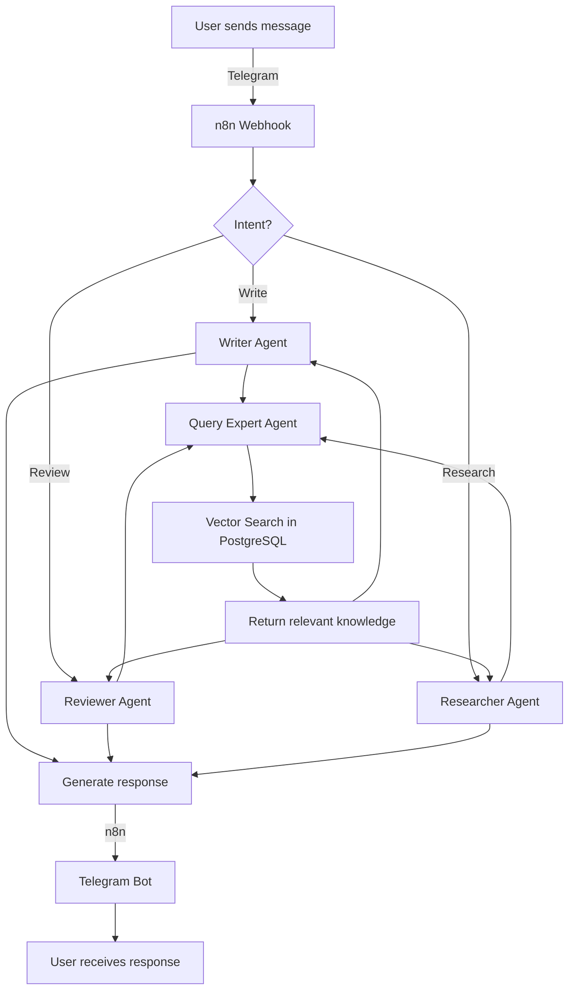
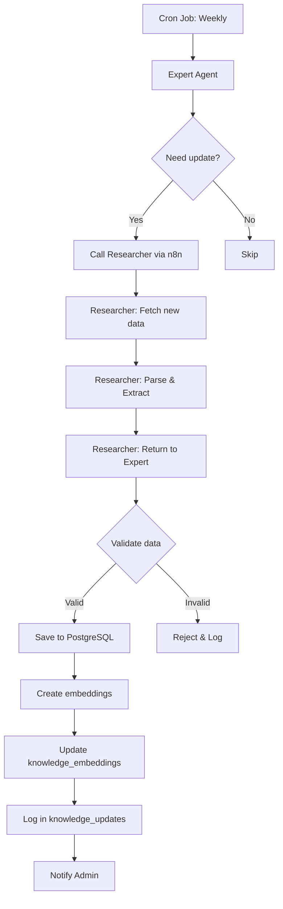
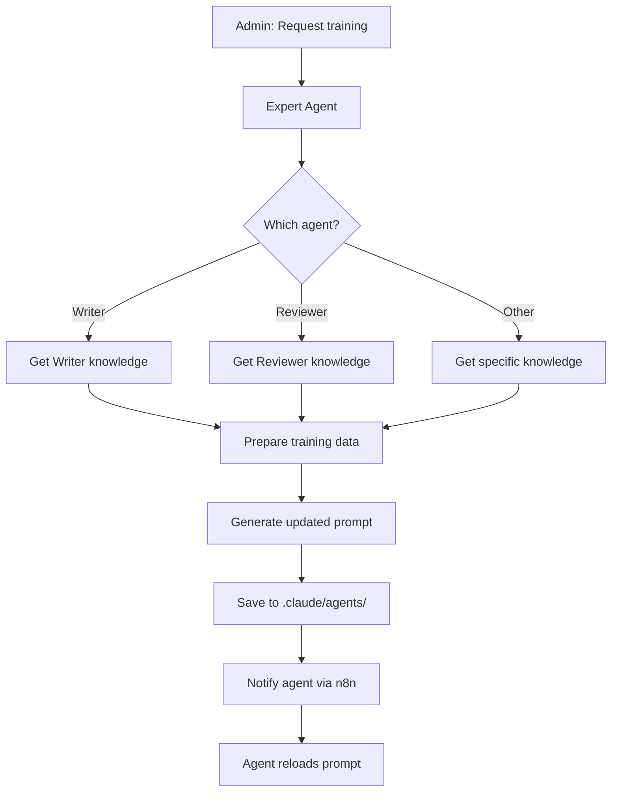

# Архитектура Expert Agent для GrantService

**Дата:** 2025-10-17
**Версия:** 0.1 (Planning)
**Авторы:** User + Claude Code (grant-architect agent)

---

## 📋 Оглавление

1. [Концепция и Мотивация](#концепция-и-мотивация)
2. [Архитектурный Обзор](#архитектурный-обзор)
3. [Компоненты Системы](#компоненты-системы)
4. [База Данных](#база-данных)
5. [Expert Agent Класс](#expert-agent-класс)
6. [Интеграция с Агентами](#интеграция-с-агентами)
7. [Workflow и Процессы](#workflow-и-процессы)
8. [Технический Стек](#технический-стек)
9. [5-Этапный План Реализации](#5-этапный-план-реализации)

---

## Концепция и Мотивация

### Исходная идея (от пользователя):

> "А если к нашим агентам на сервере в сервисе создавать внутреннего агента Эксперта, и чтобы база знаний была в базе данных, и на основе нее можно было бы дообучать и ревьювера, и писателя, и ресерчера, и интервьюера? А также он бы мог вызывать ресерчера для пополнения своей базы знаний."

### Проблемы текущего подхода:

1. **База знаний в markdown файлах:**
   - Сложно обновлять динамически
   - Нет версионности
   - Нет семантического поиска
   - Большой размер файла (329 KB) загружается весь сразу
   - Нет структуры для разных фондов

2. **Агенты не "обучаются":**
   - Промпты статичные
   - Новые требования = ручное обновление markdown
   - Нет централизованного источника правды
   - Каждый агент читает свою часть БЗ

3. **Нет интеграции между агентами:**
   - Researcher собирает информацию, но не обновляет БЗ автоматически
   - Writer/Reviewer не получают автоматических обновлений
   - Нет обратной связи между агентами

### Решение: Expert Agent как центральный хаб

**Ключевые принципы:**

1. **Single Source of Truth:**
   - PostgreSQL база данных с полной БЗ
   - Версионность и история изменений
   - Структурированное хранение (таблицы + JSONB)

2. **Динамическое обучение агентов:**
   - Expert генерирует промпты для агентов на основе актуальной БЗ
   - Агенты всегда работают с последней версией требований
   - Централизованное управление знаниями

3. **Семантический поиск:**
   - Векторные embeddings (pgvector)
   - Быстрый поиск релевантной информации
   - Контекстно-зависимые ответы

4. **Двусторонняя интеграция:**
   - Expert → Researcher: "Обнови информацию о требованиях ФПГ 2025"
   - Researcher → Expert: "Вот новая информация, сохрани в БЗ"
   - Expert → Writer/Reviewer: "Вот актуальные требования для заявки"

---

## Архитектурный Обзор

### High-Level Architecture

```
┌─────────────────────────────────────────────────────────────┐
│                    GrantService Ecosystem                    │
└─────────────────────────────────────────────────────────────┘

┌──────────────┐         ┌──────────────────────────────────┐
│  Telegram    │         │          n8n Workflow            │
│     Bot      │◄────────┤        Orchestrator              │
└──────────────┘         └──────────────────────────────────┘
                                      │
                         ┌────────────┼────────────┐
                         │            │            │
                         ▼            ▼            ▼
                  ┌────────────┐ ┌────────┐ ┌──────────┐
                  │   Writer   │ │Reviewer│ │Interview.│
                  │   Agent    │ │ Agent  │ │  Agent   │
                  └────────────┘ └────────┘ └──────────┘
                         │            │            │
                         └────────────┼────────────┘
                                      │
                         ┌────────────▼────────────┐
                         │    EXPERT AGENT         │
                         │  (Knowledge Hub)        │
                         │                         │
                         │  ┌──────────────────┐   │
                         │  │ query_knowledge()│   │
                         │  │ train_agent()    │   │
                         │  │ update_knowledge │   │
                         │  └──────────────────┘   │
                         └────────────┬────────────┘
                                      │
                    ┌─────────────────┼─────────────────┐
                    │                 │                 │
                    ▼                 ▼                 ▼
            ┌────────────┐  ┌──────────────┐  ┌────────────┐
            │ PostgreSQL │  │  Researcher  │  │  GigaChat  │
            │  + pgvector│  │    Agent     │  │    API     │
            └────────────┘  └──────────────┘  └────────────┘
                  │
                  │  Knowledge Base Tables:
                  ├─ knowledge_sources
                  ├─ knowledge_sections
                  ├─ successful_examples
                  ├─ evaluation_criteria
                  ├─ knowledge_embeddings
                  └─ knowledge_updates
```

### Компоненты и их роли:

1. **Expert Agent (NEW):**
   - Центральный хаб знаний
   - Управляет базой данных
   - Обучает других агентов
   - Координирует обновления через Researcher

2. **PostgreSQL + pgvector:**
   - Хранилище структурированных знаний
   - Векторный поиск для семантики
   - История изменений и версионность

3. **Writer/Reviewer/Interviewer Agents:**
   - Получают знания от Expert
   - Работают с актуальной информацией
   - Фокусируются на своих задачах

4. **Researcher Agent:**
   - Собирает новую информацию по запросу Expert
   - Валидирует и структурирует данные
   - Возвращает результат Expert для сохранения

5. **n8n Workflow:**
   - Оркестрирует взаимодействие между агентами
   - Управляет потоками данных
   - Логирование и мониторинг

---

## Компоненты Системы

### 1. Expert Agent Service

**Технологии:**
- Python 3.11+
- FastAPI (REST API)
- asyncpg (PostgreSQL async driver)
- asyncio (async operations)

**Основные функции:**

1. **Knowledge Query Service:**
   ```python
   POST /api/expert/query
   {
       "question": "Какие ограничения по символам в разделе 'О проекте'?",
       "fund": "fpg",
       "context": "writing_application"
   }

   Response:
   {
       "answer": "Название проекта: 300 символов, Обоснование: 5000 символов",
       "sources": [42, 84, 91],
       "confidence": 0.92,
       "relevant_sections": [...]
   }
   ```

2. **Agent Training Service:**
   ```python
   POST /api/expert/train
   {
       "agent_name": "writer",
       "fund": "fpg",
       "section": "project_goals"
   }

   Response:
   {
       "status": "success",
       "updated_prompt": "...",
       "knowledge_items": 15,
       "version": "2025-10-17_v1"
   }
   ```

3. **Knowledge Update Service:**
   ```python
   POST /api/expert/update
   {
       "topic": "fpg_requirements_2025",
       "trigger": "manual|scheduled|researcher"
   }

   Response:
   {
       "status": "updating",
       "researcher_task_id": "task_12345",
       "estimated_time": "5m"
   }
   ```

### 2. Database Service (PostgreSQL + pgvector)

**Версия:** PostgreSQL 14+
**Расширения:** pgvector 0.5+

**Функции:**
- Хранение структурированных знаний
- Векторный поиск (HNSW индексы)
- ACID транзакции
- Репликация и бэкапы

### 3. Embeddings Service

**Модели (на выбор):**
- **ruBERT** (локально или через API)
- **sberGPT embeddings** (через SberDevices API)
- **Fallback:** OpenAI embeddings (text-embedding-3-small)

**Функции:**
- Генерация векторов для текста (1536 измерений)
- Кэширование embeddings
- Batch processing для больших объемов

### 4. Integration Layer (n8n)

**Workflows:**

1. **User Query → Writer → Expert → Response**
   ```
   User: "Напиши раздел 'Цели проекта'"
   │
   ▼
   n8n: Вызов Writer Agent
   │
   ▼
   Writer: Запрос к Expert "Какие требования к целям?"
   │
   ▼
   Expert: Поиск в БД → Векторный поиск → Ответ
   │
   ▼
   Writer: Генерация текста с учетом требований
   │
   ▼
   n8n: Возврат результата User
   ```

2. **Scheduled Update → Researcher → Expert → DB**
   ```
   Cron Job (еженедельно)
   │
   ▼
   Expert: "Нужно обновить требования ФПГ"
   │
   ▼
   Expert → Researcher: "Собери новую информацию с сайта ФПГ"
   │
   ▼
   Researcher: Парсинг сайта, извлечение текстов
   │
   ▼
   Researcher → Expert: "Вот новые данные"
   │
   ▼
   Expert: Валидация → Сохранение в БД → Обновление embeddings
   │
   ▼
   Expert: Уведомление администратора об обновлении
   ```

---

## База Данных

### Schema Design

#### 1. `knowledge_sources` - Источники информации

```sql
CREATE TABLE knowledge_sources (
    id SERIAL PRIMARY KEY,
    fund_name VARCHAR(100) NOT NULL,           -- 'fpg', 'kultura', 'rosmolodjezh'
    source_type VARCHAR(50) NOT NULL,          -- 'official_article', 'example', 'methodical'
    title TEXT NOT NULL,                       -- "Статья 84. Раздел О проекте"
    url TEXT,                                   -- https://...
    downloaded_at TIMESTAMP DEFAULT NOW(),
    version VARCHAR(20),                        -- '2025', '2024'
    is_active BOOLEAN DEFAULT true,             -- Актуальность источника
    metadata JSONB,                             -- Дополнительные данные
    created_at TIMESTAMP DEFAULT NOW(),
    updated_at TIMESTAMP DEFAULT NOW()
);

CREATE INDEX idx_sources_fund ON knowledge_sources(fund_name);
CREATE INDEX idx_sources_active ON knowledge_sources(is_active);
CREATE INDEX idx_sources_type ON knowledge_sources(source_type);
```

**Примеры записей:**
```sql
INSERT INTO knowledge_sources (fund_name, source_type, title, url, version) VALUES
('fpg', 'official_article', 'Статья 84. Раздел О проекте', 'https://президентскиегранты.рф/...', '2025'),
('fpg', 'official_article', 'Статья 86. Раздел Команда проекта', 'https://...', '2025'),
('fpg', 'example', 'Успешная заявка №123456 (2021)', null, '2021');
```

#### 2. `knowledge_sections` - Разделы документов

```sql
CREATE TABLE knowledge_sections (
    id SERIAL PRIMARY KEY,
    source_id INTEGER REFERENCES knowledge_sources(id) ON DELETE CASCADE,
    section_type VARCHAR(50) NOT NULL,         -- 'requirement', 'example', 'tip', 'criterion'
    section_name TEXT NOT NULL,                -- "Цель проекта", "Бюджет", "Команда"
    content TEXT NOT NULL,                     -- Полный текст раздела
    char_limit INTEGER,                        -- Ограничение символов (если есть)
    priority INTEGER DEFAULT 5,                -- 1-10, важность раздела
    metadata JSONB,                            -- Доп. данные
    created_at TIMESTAMP DEFAULT NOW(),
    updated_at TIMESTAMP DEFAULT NOW()
);

CREATE INDEX idx_sections_source ON knowledge_sections(source_id);
CREATE INDEX idx_sections_type ON knowledge_sections(section_type);
CREATE INDEX idx_sections_name ON knowledge_sections(section_name);
```

**Примеры записей:**
```sql
INSERT INTO knowledge_sections (source_id, section_type, section_name, content, char_limit, priority) VALUES
(1, 'requirement', 'Название проекта', 'Название проекта должно быть кратким...', 300, 10),
(1, 'requirement', 'Обоснование социальной значимости', 'Необходимо описать проблему...', 5000, 10),
(3, 'example', 'Цель проекта (пример)', 'Организовать дополнительное обучение...', NULL, 7);
```

#### 3. `successful_examples` - Примеры успешных заявок

```sql
CREATE TABLE successful_examples (
    id SERIAL PRIMARY KEY,
    fund_name VARCHAR(100) NOT NULL,
    application_number VARCHAR(50),            -- Номер заявки
    year INTEGER NOT NULL,                     -- Год победы
    direction VARCHAR(200),                    -- Направление конкурса
    requested_amount DECIMAL(12, 2),           -- Запрошенная сумма
    cofinancing_amount DECIMAL(12, 2),         -- Софинансирование
    status VARCHAR(50) DEFAULT 'winner',       -- 'winner', 'finalist'
    full_text TEXT,                            -- Полный текст заявки
    extracted_parts JSONB,                     -- Извлеченные разделы
    created_at TIMESTAMP DEFAULT NOW()
);

CREATE INDEX idx_examples_fund ON successful_examples(fund_name);
CREATE INDEX idx_examples_year ON successful_examples(year);
CREATE INDEX idx_examples_direction ON successful_examples(direction);
```

**Структура `extracted_parts` JSONB:**
```json
{
  "project_name": "Образовательная робототехника для школьников",
  "goals": "Организовать дополнительное обучение...",
  "tasks": ["Разработать программу", "Провести набор", ...],
  "target_group": "Старшеклассники 10-11 классов города Сарапул",
  "budget": {
    "total": 500000,
    "by_category": {...}
  },
  "team": [...]
}
```

#### 4. `evaluation_criteria` - Критерии оценки

```sql
CREATE TABLE evaluation_criteria (
    id SERIAL PRIMARY KEY,
    fund_name VARCHAR(100) NOT NULL,
    criterion_number INTEGER,                  -- 1-10 для ФПГ
    criterion_name VARCHAR(200) NOT NULL,
    max_score INTEGER NOT NULL,                -- Макс. баллов (обычно 10)
    description TEXT NOT NULL,                 -- Что оценивается
    examples TEXT,                             -- Примеры хороших практик
    tips TEXT,                                 -- Советы для заявителей
    created_at TIMESTAMP DEFAULT NOW()
);

CREATE INDEX idx_criteria_fund ON evaluation_criteria(fund_name);
CREATE INDEX idx_criteria_number ON evaluation_criteria(criterion_number);
```

**Примеры записей:**
```sql
INSERT INTO evaluation_criteria (fund_name, criterion_number, criterion_name, max_score, description) VALUES
('fpg', 1, 'Информационная открытость организации', 10, 'Оценивается наличие сайта, соцсетей...'),
('fpg', 2, 'Опыт организации по успешной реализации программ', 10, 'Опыт реализации похожих проектов...'),
('fpg', 4, 'Актуальность проблемы и социальная значимость', 10, 'Обоснованность проблемы...');
```

#### 5. `knowledge_embeddings` - Векторные представления

```sql
CREATE EXTENSION IF NOT EXISTS vector;

CREATE TABLE knowledge_embeddings (
    id SERIAL PRIMARY KEY,
    section_id INTEGER REFERENCES knowledge_sections(id) ON DELETE CASCADE,
    embedding vector(1536),                    -- Вектор 1536 измерений
    model_name VARCHAR(50) DEFAULT 'rubert',   -- 'rubert', 'sbergpt', 'openai'
    created_at TIMESTAMP DEFAULT NOW()
);

-- HNSW индекс для быстрого векторного поиска
CREATE INDEX idx_embeddings_hnsw ON knowledge_embeddings
USING hnsw (embedding vector_cosine_ops)
WITH (m = 16, ef_construction = 64);

CREATE INDEX idx_embeddings_section ON knowledge_embeddings(section_id);
```

**Как работает:**
```python
# 1. Создание embedding для нового раздела
section_text = "Название проекта должно быть кратким..."
embedding = embedding_service.get_embedding(section_text)  # [0.123, -0.456, ...]

# 2. Сохранение в БД
INSERT INTO knowledge_embeddings (section_id, embedding, model_name)
VALUES (42, embedding, 'rubert')

# 3. Поиск похожих разделов
query = "Какие требования к названию?"
query_embedding = embedding_service.get_embedding(query)

SELECT ks.*, ke.embedding <=> query_embedding AS distance
FROM knowledge_sections ks
JOIN knowledge_embeddings ke ON ke.section_id = ks.id
ORDER BY distance
LIMIT 5;
```

#### 6. `knowledge_updates` - История обновлений

```sql
CREATE TABLE knowledge_updates (
    id SERIAL PRIMARY KEY,
    updated_by VARCHAR(50) NOT NULL,           -- 'expert_agent', 'researcher', 'admin'
    update_type VARCHAR(50) NOT NULL,          -- 'new', 'modified', 'deleted', 'bulk_import'
    description TEXT,                          -- Описание изменения
    affected_tables TEXT[],                    -- ['knowledge_sections', 'successful_examples']
    record_ids INTEGER[],                      -- IDs измененных записей
    metadata JSONB,                            -- Дополнительные данные
    created_at TIMESTAMP DEFAULT NOW()
);

CREATE INDEX idx_updates_by ON knowledge_updates(updated_by);
CREATE INDEX idx_updates_type ON knowledge_updates(update_type);
CREATE INDEX idx_updates_date ON knowledge_updates(created_at);
```

**Примеры использования:**
```sql
-- Лог обновления через Researcher
INSERT INTO knowledge_updates (updated_by, update_type, description, affected_tables, record_ids) VALUES
('researcher', 'new', 'Добавлены новые требования ФПГ 2025',
 ARRAY['knowledge_sources', 'knowledge_sections'],
 ARRAY[101, 102, 103]);

-- Лог удаления устаревшей информации
INSERT INTO knowledge_updates (updated_by, update_type, description) VALUES
('admin', 'deleted', 'Удалены требования ФПГ 2023 (устарели)');
```

### Database Views (для удобства)

```sql
-- View: Актуальные требования с embeddings
CREATE VIEW v_active_knowledge AS
SELECT
    ks.id,
    ks.fund_name,
    ks.section_name,
    ks.content,
    ks.char_limit,
    ke.embedding,
    src.title AS source_title,
    src.url AS source_url
FROM knowledge_sections ks
JOIN knowledge_sources src ON src.id = ks.source_id
LEFT JOIN knowledge_embeddings ke ON ke.section_id = ks.id
WHERE src.is_active = true;

-- View: Статистика по фондам
CREATE VIEW v_knowledge_stats AS
SELECT
    fund_name,
    COUNT(DISTINCT id) AS total_sources,
    COUNT(DISTINCT CASE WHEN is_active THEN id END) AS active_sources,
    MAX(updated_at) AS last_update
FROM knowledge_sources
GROUP BY fund_name;
```

---

## Expert Agent Класс

### Python Implementation

```python
# expert_agent/expert_agent.py

import asyncpg
from typing import List, Dict, Optional
import numpy as np
from datetime import datetime

class ExpertAgent:
    """
    Центральный агент-эксперт по грантам
    Управляет базой знаний и обучает других агентов
    """

    def __init__(self, db_pool: asyncpg.Pool, embeddings_service, llm_client):
        """
        Args:
            db_pool: Connection pool к PostgreSQL
            embeddings_service: Сервис для генерации embeddings (ruBERT/sberGPT)
            llm_client: Клиент для LLM (GigaChat, OpenAI, etc.)
        """
        self.db = db_pool
        self.embeddings = embeddings_service
        self.llm = llm_client

    async def query_knowledge(
        self,
        question: str,
        fund: str = 'fpg',
        top_k: int = 5,
        min_similarity: float = 0.75
    ) -> Dict:
        """
        Семантический поиск по базе знаний

        Args:
            question: Вопрос пользователя
            fund: Фонд ('fpg', 'kultura', etc.)
            top_k: Количество релевантных разделов
            min_similarity: Минимальная схожесть (0-1)

        Returns:
            {
                'answer': str,
                'sources': List[int],
                'confidence': float,
                'relevant_sections': List[Dict]
            }
        """
        # 1. Создать embedding для вопроса
        question_embedding = await self.embeddings.get_embedding(question)

        # 2. Векторный поиск в БД
        relevant_sections = await self._vector_search(
            question_embedding,
            fund,
            top_k,
            min_similarity
        )

        if not relevant_sections:
            return {
                'answer': 'К сожалению, не нашел релевантной информации в базе знаний.',
                'sources': [],
                'confidence': 0.0,
                'relevant_sections': []
            }

        # 3. Сформировать контекст для LLM
        context = self._build_context(relevant_sections)

        # 4. Генерация ответа через LLM
        answer = await self.llm.generate(
            system_prompt=f"Ты эксперт по грантовым заявкам фонда {fund.upper()}.",
            context=context,
            question=question
        )

        # 5. Рассчитать уверенность
        confidence = self._calculate_confidence(relevant_sections)

        return {
            'answer': answer,
            'sources': [s['id'] for s in relevant_sections],
            'confidence': confidence,
            'relevant_sections': relevant_sections
        }

    async def _vector_search(
        self,
        query_embedding: np.ndarray,
        fund: str,
        top_k: int,
        min_similarity: float
    ) -> List[Dict]:
        """Векторный поиск похожих разделов"""

        query = """
        SELECT
            ks.id,
            ks.section_name,
            ks.content,
            ks.char_limit,
            ks.priority,
            src.title AS source_title,
            src.url AS source_url,
            1 - (ke.embedding <=> $1::vector) AS similarity
        FROM knowledge_sections ks
        JOIN knowledge_sources src ON src.id = ks.source_id
        JOIN knowledge_embeddings ke ON ke.section_id = ks.id
        WHERE
            src.fund_name = $2
            AND src.is_active = true
            AND (1 - (ke.embedding <=> $1::vector)) >= $3
        ORDER BY ke.embedding <=> $1::vector
        LIMIT $4
        """

        async with self.db.acquire() as conn:
            rows = await conn.fetch(
                query,
                query_embedding.tolist(),
                fund,
                min_similarity,
                top_k
            )

        return [dict(row) for row in rows]

    def _build_context(self, sections: List[Dict]) -> str:
        """Построить контекст для LLM из найденных разделов"""
        context_parts = []

        for i, section in enumerate(sections, 1):
            context_parts.append(f"""
**Источник {i}:** {section['source_title']}
**Раздел:** {section['section_name']}
**Релевантность:** {section['similarity']:.2%}
{section['content']}
            """.strip())

        return "\n\n---\n\n".join(context_parts)

    def _calculate_confidence(self, sections: List[Dict]) -> float:
        """Рассчитать уверенность в ответе на основе similarity scores"""
        if not sections:
            return 0.0

        # Средняя similarity с весом на top-1
        top_similarity = sections[0]['similarity']
        avg_similarity = np.mean([s['similarity'] for s in sections])

        # Weighted average (60% top-1, 40% average)
        confidence = 0.6 * top_similarity + 0.4 * avg_similarity

        return round(confidence, 3)

    async def train_agent(
        self,
        agent_name: str,
        fund: str = 'fpg',
        section: Optional[str] = None
    ) -> Dict:
        """
        Дообучить конкретного агента на основе БЗ
        Генерирует актуальный промпт для агента

        Args:
            agent_name: 'writer', 'reviewer', 'researcher', 'interviewer'
            fund: Фонд
            section: Конкретный раздел (опционально)

        Returns:
            {
                'status': 'success',
                'updated_prompt': str,
                'knowledge_items': int,
                'version': str
            }
        """
        # 1. Получить знания для конкретного агента
        if agent_name == 'writer':
            knowledge = await self._get_writer_knowledge(fund, section)
        elif agent_name == 'reviewer':
            knowledge = await self._get_reviewer_knowledge(fund)
        elif agent_name == 'researcher':
            knowledge = await self._get_researcher_knowledge(fund)
        elif agent_name == 'interviewer':
            knowledge = await self._get_interviewer_knowledge(fund)
        else:
            raise ValueError(f"Unknown agent: {agent_name}")

        # 2. Подготовить training data
        training_data = self._prepare_training_data(knowledge, agent_name)

        # 3. Обновить промпт агента (через n8n API или файл)
        version = datetime.now().strftime('%Y-%m-%d_v1')
        updated_prompt = await self._update_agent_prompt(
            agent_name,
            training_data,
            version
        )

        return {
            'status': 'success',
            'updated_prompt': updated_prompt,
            'knowledge_items': len(knowledge),
            'version': version
        }

    async def _get_writer_knowledge(self, fund: str, section: Optional[str]) -> List[Dict]:
        """Получить знания для Writer агента"""
        query = """
        SELECT
            ks.section_name,
            ks.content,
            ks.char_limit,
            ks.priority,
            src.title
        FROM knowledge_sections ks
        JOIN knowledge_sources src ON src.id = ks.source_id
        WHERE
            src.fund_name = $1
            AND src.is_active = true
            AND ks.section_type IN ('requirement', 'example', 'tip')
        """

        if section:
            query += " AND ks.section_name = $2"
            params = [fund, section]
        else:
            params = [fund]

        query += " ORDER BY ks.priority DESC, ks.section_name"

        async with self.db.acquire() as conn:
            rows = await conn.fetch(query, *params)

        return [dict(row) for row in rows]

    async def _get_reviewer_knowledge(self, fund: str) -> List[Dict]:
        """Получить знания для Reviewer агента (критерии оценки)"""
        query = """
        SELECT
            criterion_number,
            criterion_name,
            max_score,
            description,
            examples,
            tips
        FROM evaluation_criteria
        WHERE fund_name = $1
        ORDER BY criterion_number
        """

        async with self.db.acquire() as conn:
            rows = await conn.fetch(query, fund)

        return [dict(row) for row in rows]

    def _prepare_training_data(self, knowledge: List[Dict], agent_name: str) -> str:
        """Подготовить training data для агента"""

        if agent_name == 'writer':
            # Форматировать требования для Writer
            sections = []
            for item in knowledge:
                section = f"### {item['section_name']}\n"
                if item['char_limit']:
                    section += f"**Ограничение:** {item['char_limit']} символов\n"
                section += f"{item['content']}\n"
                sections.append(section)

            return "\n".join(sections)

        elif agent_name == 'reviewer':
            # Форматировать критерии для Reviewer
            criteria = []
            for item in knowledge:
                criterion = f"""
**Критерий {item['criterion_number']}: {item['criterion_name']}**
Максимум баллов: {item['max_score']}
Описание: {item['description']}
                """.strip()
                if item['tips']:
                    criterion += f"\nСоветы: {item['tips']}"
                criteria.append(criterion)

            return "\n\n".join(criteria)

        # TODO: Другие агенты
        return ""

    async def _update_agent_prompt(
        self,
        agent_name: str,
        training_data: str,
        version: str
    ) -> str:
        """Обновить промпт агента"""
        # TODO: Реализовать интеграцию с n8n или файловой системой
        # Например, обновить файл .claude/agents/{agent_name}.md

        updated_prompt = f"""
# {agent_name.title()} Agent

**Версия:** {version}
**Обновлено Expert Agent:** {datetime.now().isoformat()}

## Актуальные требования

{training_data}

## Инструкции

[... остальной промпт агента ...]
        """.strip()

        return updated_prompt

    async def update_knowledge(
        self,
        topic: str,
        fund: str = 'fpg',
        trigger: str = 'manual'
    ) -> Dict:
        """
        Обновить знания через Researcher агента

        Args:
            topic: Тема для обновления
            fund: Фонд
            trigger: 'manual', 'scheduled', 'auto'

        Returns:
            {
                'status': 'success',
                'sections_added': int,
                'sections_updated': int
            }
        """
        # 1. Вызвать Researcher агента
        new_info = await self._call_researcher_agent(topic, fund)

        if not new_info:
            return {'status': 'no_data', 'message': 'Researcher не нашел новой информации'}

        # 2. Валидировать информацию
        validation_result = await self._validate_information(new_info)
        if not validation_result['is_valid']:
            return {
                'status': 'rejected',
                'reason': validation_result['reason']
            }

        # 3. Сохранить в БД
        sections_added, sections_updated = await self._save_knowledge(new_info, fund)

        # 4. Создать embeddings для новых разделов
        await self._create_embeddings_for_new_sections(sections_added)

        # 5. Залогировать обновление
        await self._log_update('researcher', 'new', f'Updated {topic}', sections_added)

        return {
            'status': 'success',
            'sections_added': len(sections_added),
            'sections_updated': len(sections_updated)
        }

    async def _call_researcher_agent(self, topic: str, fund: str) -> Dict:
        """Вызвать Researcher агента через n8n"""
        # TODO: Реализовать вызов n8n webhook
        # POST https://n8n.example.com/webhook/researcher
        # {
        #     "task": "fetch_requirements",
        #     "fund": "fpg",
        #     "topic": topic
        # }
        pass

    async def _validate_information(self, info: Dict) -> Dict:
        """Валидировать новую информацию"""
        # Проверки:
        # 1. Есть ли текст?
        # 2. Указан ли источник (URL)?
        # 3. Не дубликат ли?
        # 4. Качество текста (через LLM?)

        if not info.get('content'):
            return {'is_valid': False, 'reason': 'No content'}

        if not info.get('source_url'):
            return {'is_valid': False, 'reason': 'No source URL'}

        # TODO: Проверка на дубликаты

        return {'is_valid': True}

    async def _save_knowledge(self, info: Dict, fund: str) -> tuple:
        """Сохранить знания в БД"""
        sections_added = []
        sections_updated = []

        async with self.db.acquire() as conn:
            # 1. Создать/найти source
            source_id = await conn.fetchval("""
                INSERT INTO knowledge_sources (fund_name, source_type, title, url, version)
                VALUES ($1, $2, $3, $4, $5)
                ON CONFLICT (url) DO UPDATE SET updated_at = NOW()
                RETURNING id
            """, fund, info['source_type'], info['title'], info['source_url'], info['version'])

            # 2. Добавить разделы
            for section in info['sections']:
                section_id = await conn.fetchval("""
                    INSERT INTO knowledge_sections
                    (source_id, section_type, section_name, content, char_limit, priority)
                    VALUES ($1, $2, $3, $4, $5, $6)
                    RETURNING id
                """, source_id, section['type'], section['name'],
                   section['content'], section.get('char_limit'), section.get('priority', 5))

                sections_added.append(section_id)

        return sections_added, sections_updated

    async def _create_embeddings_for_new_sections(self, section_ids: List[int]):
        """Создать embeddings для новых разделов"""
        async with self.db.acquire() as conn:
            for section_id in section_ids:
                # Получить текст
                content = await conn.fetchval(
                    "SELECT content FROM knowledge_sections WHERE id = $1",
                    section_id
                )

                # Создать embedding
                embedding = await self.embeddings.get_embedding(content)

                # Сохранить
                await conn.execute("""
                    INSERT INTO knowledge_embeddings (section_id, embedding, model_name)
                    VALUES ($1, $2, $3)
                """, section_id, embedding.tolist(), 'rubert')

    async def _log_update(
        self,
        updated_by: str,
        update_type: str,
        description: str,
        record_ids: List[int]
    ):
        """Залогировать обновление в knowledge_updates"""
        async with self.db.acquire() as conn:
            await conn.execute("""
                INSERT INTO knowledge_updates
                (updated_by, update_type, description, affected_tables, record_ids)
                VALUES ($1, $2, $3, $4, $5)
            """, updated_by, update_type, description,
               ['knowledge_sections'], record_ids)
```

---

## Интеграция с Агентами

### 1. Writer Agent Integration

**Старый workflow (без Expert):**
```
User: "Напиши раздел 'Цели проекта'"
│
▼
Writer: Читает UNIFIED_KNOWLEDGE_BASE.md (весь файл 329 KB)
│
▼
Writer: Генерирует текст на основе markdown
│
▼
User: Получает текст
```

**Новый workflow (с Expert):**
```
User: "Напиши раздел 'Цели проекта'"
│
▼
Writer: Запрос к Expert "Какие требования к целям проекта для ФПГ?"
│
▼
Expert: Векторный поиск → Находит 5 релевантных разделов
│
▼
Expert: Возвращает только релевантное (5-10 KB вместо 329 KB)
│
▼
Writer: Генерирует текст с учетом актуальных требований
│
▼
User: Получает текст
```

**Преимущества:**
- ⚡ Быстрее (меньше токенов)
- 📊 Актуальнее (БД обновляется автоматически)
- 🎯 Релевантнее (только нужная информация)

### 2. Reviewer Agent Integration

**Задача Reviewer:** Оценить заявку по 10 критериям ФПГ

**С Expert Agent:**
```
Reviewer: "Дай мне критерии оценки для ФПГ"
│
▼
Expert: SELECT * FROM evaluation_criteria WHERE fund_name = 'fpg'
│
▼
Expert: Возвращает 10 критериев с описаниями и советами
│
▼
Reviewer: Оценивает заявку по каждому критерию
│
▼
Reviewer: Возвращает оценки + рекомендации
```

### 3. Researcher Agent Integration (двусторонняя!)

**Сценарий 1: Expert вызывает Researcher**
```
Cron Job: Еженедельное обновление
│
▼
Expert: "Нужно обновить требования ФПГ на 2025 год"
│
▼
Expert → Researcher: "Собери новую информацию с сайта ФПГ"
│
▼
Researcher: Парсит сайт, извлекает новые статьи
│
▼
Researcher → Expert: "Вот новые данные [...]"
│
▼
Expert: Валидация → Сохранение в БД → Embeddings
```

**Сценарий 2: Researcher использует Expert**
```
User: "Найди примеры успешных заявок по направлению 'Образование'"
│
▼
Researcher: Запрос к Expert "Примеры заявок по образованию?"
│
▼
Expert: SELECT * FROM successful_examples WHERE direction LIKE '%образование%'
│
▼
Expert: Возвращает 3 примера
│
▼
Researcher: Форматирует и возвращает User
```

### 4. Interviewer Agent Integration

**Задача Interviewer:** Собрать информацию у пользователя для заявки

**С Expert Agent:**
```
Interviewer: "Какие вопросы задать для раздела 'О проекте'?"
│
▼
Expert: Находит все required поля раздела "О проекте"
│
▼
Expert: Возвращает список:
  - Название проекта (макс 300 символов)
  - Обоснование значимости (макс 5000 символов)
  - Целевая группа
  - ...
│
▼
Interviewer: Задает вопросы пользователю по списку
│
▼
Interviewer: Собирает ответы
```

---

## Workflow и Процессы

### Process 1: User Query Flow



### Process 2: Knowledge Update Flow



### Process 3: Agent Training Flow



---

## Технический Стек

### Backend

| Компонент | Технология | Версия | Назначение |
|-----------|-----------|--------|-----------|
| Runtime | Python | 3.11+ | Основной язык |
| Web Framework | FastAPI | 0.104+ | REST API |
| DB Driver | asyncpg | 0.29+ | Async PostgreSQL |
| Embeddings | sentence-transformers | 2.2+ | ruBERT embeddings |
| Vector DB | pgvector | 0.5+ | Векторный поиск |
| LLM Client | openai / gigachat | latest | Генерация ответов |
| Orchestration | n8n | self-hosted | Workflow |
| Queue | Celery + Redis | optional | Async tasks |

### Database

| Компонент | Технология | Версия | Назначение |
|-----------|-----------|--------|-----------|
| СУБД | PostgreSQL | 14+ | Основная БД |
| Extension | pgvector | 0.5+ | Векторы |
| Migration | Alembic | 1.12+ | Миграции |
| Backup | pg_dump | native | Бэкапы |

### Infrastructure

| Компонент | Технология | Назначение |
|-----------|-----------|-----------|
| Container | Docker | Изоляция сервисов |
| Orchestration | Docker Compose | Локальная разработка |
| CI/CD | GitHub Actions | Автоматизация |
| Monitoring | Prometheus + Grafana | Метрики |
| Logging | ELK Stack | Логи |

---

## 5-Этапный План Реализации

### Этап 1: Database Schema (неделя 1)

**Цель:** Создать и заполнить PostgreSQL базу данных

**Задачи:**
1. ✅ Спроектировать схему БД (6 таблиц)
2. ⏳ Установить PostgreSQL 14+ и pgvector
3. ⏳ Написать SQL миграцию (DDL)
4. ⏳ Создать индексы (B-tree + HNSW)
5. ⏳ Написать integration tests для схемы

**Deliverables:**
- `schema.sql` - полная схема
- `001_initial_migration.sql` - Alembic миграция
- `test_schema.py` - тесты

**Критерий успеха:** БД создана, все таблицы и индексы работают

---

### Этап 2: Data Migration (неделя 2)

**Цель:** Мигрировать текущую БЗ из markdown в PostgreSQL

**Задачи:**
1. ⏳ Написать парсер для UNIFIED_KNOWLEDGE_BASE.md
2. ⏳ Создать маппинг: markdown → SQL таблицы
3. ⏳ Загрузить официальные требования ФПГ
4. ⏳ Загрузить примеры успешных заявок
5. ⏳ Создать embeddings для всех разделов
6. ⏳ Валидация: проверить количество записей

**Deliverables:**
- `migrate_knowledge.py` - скрипт миграции
- `create_embeddings.py` - генерация векторов
- Заполненная БД с ~100-150 разделами

**Критерий успеха:** Все 329 KB данных в БД, embeddings созданы

---

### Этап 3: Expert Agent Implementation (неделя 3-4)

**Цель:** Реализовать базовый ExpertAgent класс

**Задачи:**
1. ⏳ Реализовать `ExpertAgent` класс
2. ⏳ Реализовать `query_knowledge()` с векторным поиском
3. ⏳ Реализовать `train_agent()` для генерации промптов
4. ⏳ Настроить embeddings service (ruBERT)
5. ⏳ Написать unit-тесты для всех методов
6. ⏳ Написать integration-тесты с реальной БД
7. ⏳ Создать FastAPI endpoints

**Deliverables:**
- `expert_agent.py` - основной класс
- `embeddings_service.py` - сервис embeddings
- `api.py` - FastAPI роуты
- `test_expert_agent.py` - полное покрытие тестами

**Критерий успеха:** Expert отвечает на вопросы с точностью 80%+

---

### Этап 4: Writer Integration (неделя 5)

**Цель:** Интегрировать Writer агента с Expert

**Задачи:**
1. ⏳ Модифицировать n8n workflow для Writer
2. ⏳ Writer вызывает Expert перед генерацией
3. ⏳ Логирование всех запросов Writer → Expert
4. ⏳ A/B тестирование: старый vs новый Writer
5. ⏳ Сравнить качество генерируемых текстов
6. ⏳ Оптимизировать промпты на основе результатов

**Deliverables:**
- Обновленный n8n workflow
- Логи запросов (для анализа)
- Отчет A/B тестирования

**Критерий успеха:** Качество текстов улучшилось на 20%+

---

### Этап 5: Full Integration (неделя 6-8)

**Цель:** Интегрировать всех агентов и добавить автообновление

**Задачи:**
1. ⏳ Интегрировать Reviewer с Expert
2. ⏳ Двусторонняя интеграция Researcher ↔ Expert
3. ⏳ Интегрировать Interviewer с Expert
4. ⏳ Реализовать `update_knowledge()` через Researcher
5. ⏳ Настроить cron job для еженедельного обновления
6. ⏳ Создать Web Admin панель для управления БЗ
7. ⏳ Настроить мониторинг (Prometheus + Grafana)
8. ⏳ Написать документацию для пользователей

**Deliverables:**
- Все 4 агента интегрированы
- Web Admin панель
- Мониторинг dashboard
- User Guide + API docs

**Критерий успеха:** Система работает автономно, обновляет БЗ

---

## Риски и Митигация

| Риск | Вероятность | Влияние | Митигация |
|------|-------------|---------|-----------|
| Качество ruBERT embeddings низкое | Средняя | Высокое | Тестировать несколько моделей, fallback на OpenAI |
| Векторный поиск медленный | Низкая | Среднее | HNSW индексы, кэширование |
| Researcher не находит новую инфо | Средняя | Среднее | Улучшить парсеры, использовать API |
| БД разрастается слишком быстро | Низкая | Низкое | Архивирование старых версий |
| Сложность интеграции с n8n | Средняя | Среднее | REST API, четкий контракт |

---

**Следующий шаг:** Реализация Этапа 1 - создание database schema

**Дата следующего обновления:** После завершения Этапа 1
