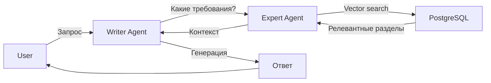
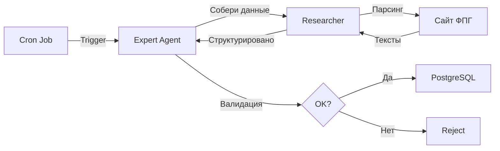

# Expert Agent Architecture - Этап Планирования

**Дата:** 2025-10-17
**Версия:** 0.1 (Planning Phase)
**Статус:** ✅ Планирование завершено

---

## 📖 О проекте

Это архитектура нового внутреннего AI-агента **Expert** для системы GrantService.

**Expert Agent** - центральный агент-эксперт, который:
- 🗄️ Хранит базу знаний в PostgreSQL (вместо markdown)
- 🔍 Использует векторные embeddings для семантического поиска
- 🎓 Дообучает других агентов (Writer, Reviewer, Researcher, Interviewer)
- 🔄 Автоматически обновляет знания через Researcher
- ✨ Служит единым источником правды о требованиях грантов

---

## 📁 Структура проекта

```
2025-10-17_Expert-Agent-Architecture/
├── README.md                          # Этот файл (навигация)
├── 00_Context/                        # Контекст и история
│   └── (будущие файлы)
├── 01_Planning/                       # Планирование
│   └── architecture.md                # ⭐ Полная архитектура (читать первым!)
├── 02_Database-Design/                # Дизайн БД
│   └── schema.sql                     # ⭐ SQL схема для PostgreSQL
├── 03_Implementation/                 # Реализация
│   └── expert_agent.py                # ⭐ Python класс ExpertAgent
└── 04_Documentation/                  # Документация
    └── (будущие файлы)
```

---

## 🚀 Быстрый старт

### 1. Прочитай главные файлы

**Для понимания концепции:**
- `01_Planning/architecture.md` - полная архитектура Expert Agent

**Для реализации:**
- `02_Database-Design/schema.sql` - создание базы данных
- `03_Implementation/expert_agent.py` - Python код

**Для контекста:**
- `C:\SnowWhiteAI\GrantService\STATUS.md` - текущий статус проекта
- `C:\SnowWhiteAI\GrantService\SESSION_CONTEXT_2025-10-17.md` - контекст сессии

---

### 2. Следующий шаг: Этап 1 (Database Schema)

**Цель:** Создать и заполнить PostgreSQL базу данных

**Действия:**
```bash
# 1. Установить PostgreSQL 14+
# Windows: https://www.postgresql.org/download/windows/
# Linux: sudo apt-get install postgresql-14

# 2. Установить pgvector
# git clone https://github.com/pgvector/pgvector.git
# cd pgvector && make && sudo make install

# 3. Создать базу данных
createdb grantservice_kb

# 4. Выполнить миграцию
psql -d grantservice_kb -f 02_Database-Design/schema.sql

# 5. Проверить
psql -d grantservice_kb -c "SELECT * FROM v_knowledge_stats;"
```

**Детали:** См. `C:\SnowWhiteAI\GrantService\STATUS.md` → Этап 1

---

## 📚 Документация

### Основные файлы

#### 1. architecture.md
**Путь:** `01_Planning/architecture.md`

**Содержит:**
- Концепция и мотивация
- High-level архитектура с диаграммами
- Описание всех компонентов
- Workflow и интеграции
- Технический стек
- 5-этапный план

**Читать для:** Понимания архитектуры системы

---

#### 2. schema.sql
**Путь:** `02_Database-Design/schema.sql`

**Содержит:**
- 6 таблиц для базы знаний
- Индексы (включая HNSW для векторного поиска)
- Views, functions, triggers
- Sample data

**Использовать для:** Создания базы данных

**Таблицы:**
- `knowledge_sources` - источники знаний
- `knowledge_sections` - разделы документов
- `successful_examples` - примеры заявок
- `evaluation_criteria` - критерии оценки
- `knowledge_embeddings` - векторные embeddings
- `knowledge_updates` - история обновлений

---

#### 3. expert_agent.py
**Путь:** `03_Implementation/expert_agent.py`

**Содержит:**
- Класс `ExpertAgent` (600+ строк)
- Методы:
  - `query_knowledge()` - семантический поиск
  - `train_agent()` - дообучение агентов
  - `update_knowledge()` - обновление БЗ
  - `health_check()` - мониторинг

**Использовать для:** Реализации Expert Agent

---

## 🔄 Workflow интеграции

### Writer использует Expert


### Expert обновляет БЗ через Researcher


---

## 🎯 5-этапный план

### ✅ Этап 0: Документирование
- [x] Архитектура
- [x] SQL схема
- [x] Python код
- [x] STATUS.md

### ⏳ Этап 1: Database Schema
- [ ] Установить PostgreSQL + pgvector
- [ ] Выполнить миграцию
- [ ] Тесты

### ⏳ Этап 2: Data Migration
- [ ] Парсинг UNIFIED_KNOWLEDGE_BASE.md
- [ ] Создание embeddings
- [ ] Загрузка в БД

### ⏳ Этап 3: Expert Agent
- [ ] Реализация класса
- [ ] FastAPI endpoints
- [ ] Тесты

### ⏳ Этап 4: Writer Integration
- [ ] n8n workflow
- [ ] A/B тестирование
- [ ] Метрики

### ⏳ Этап 5: Full Integration
- [ ] Все агенты
- [ ] Web Admin
- [ ] Мониторинг

---

## 🛠 Технический стек

| Компонент | Технология | Версия |
|-----------|-----------|--------|
| База данных | PostgreSQL | 18.0 |
| Векторный поиск | **Qdrant** | latest |
| Backend | Python | 3.11+ |
| Web Framework | FastAPI | 0.104+ |
| DB Driver | asyncpg | 0.29+ |
| Embeddings | ruBERT / sberGPT | - |
| LLM | GigaChat | - |
| Orchestration | n8n | self-hosted |

**⚠️ Важно:** Изначально планировался pgvector, но из-за проблем с установкой на Windows (PostgreSQL 18) было принято решение использовать **Qdrant** (Docker). См. полный анализ в `01_Planning/vector_database_comparison.md`

---

## 📊 Метрики успеха

### MVP (Этапы 1-4):
- База данных создана и заполнена ✅
- Expert Agent работает (accuracy 80%+)
- Writer интегрирован
- Качество текстов +20%

### Full Product (Этап 5):
- Все 4 агента интегрированы
- Автообновление БЗ
- Web Admin
- Multi-fund support

---

## 🔗 Связанные файлы

### Корневые файлы проекта
- `C:\SnowWhiteAI\GrantService\STATUS.md` - полный статус
- `C:\SnowWhiteAI\GrantService\SESSION_CONTEXT_2025-10-17.md` - контекст

### Текущая база знаний (для миграции)
- `fpg_docs_2025/UNIFIED_KNOWLEDGE_BASE.md` - 329 KB
- `fpg_docs_2025/knowledge_metadata.json` - метаданные

### Агенты
- `.claude/agents/grant-architect.md` - архитектор
- `.claude/agents/` - другие агенты

---

## 💡 Ключевые идеи

1. **Единый источник правды:** PostgreSQL вместо разрозненных markdown файлов

2. **Семантический поиск:** pgvector + ruBERT embeddings для русского языка

3. **Динамическое обучение:** Агенты всегда работают с актуальной информацией

4. **Автообновление:** Researcher автоматически обновляет БЗ по расписанию

5. **Версионность:** История всех изменений в `knowledge_updates`

---

## 🎓 Для разработчиков

### Начать разработку:

1. **Прочитай архитектуру:**
   ```bash
   cat 01_Planning/architecture.md
   ```

2. **Создай БД:**
   ```bash
   psql -d grantservice_kb -f 02_Database-Design/schema.sql
   ```

3. **Изучи код:**
   ```bash
   cat 03_Implementation/expert_agent.py
   ```

4. **Проверь STATUS:**
   ```bash
   cat C:\SnowWhiteAI\GrantService\STATUS.md
   ```

### Продолжить в новой сессии:

```
Привет! Прочитай следующие файлы:
1. C:\SnowWhiteAI\GrantService\STATUS.md
2. C:\SnowWhiteAI\GrantService\SESSION_CONTEXT_2025-10-17.md
3. C:\SnowWhiteAI\GrantService\00-Project-Stages\2025-10-17_Expert-Agent-Architecture\README.md

Продолжи реализацию Expert Agent с Этапа 1: создание database schema
```

---

## ⚠️ Важно

1. **Начинать с ФПГ:** Сначала только Фонд президентских грантов

2. **Тестировать embeddings:** ruBERT vs sberGPT - выбрать лучший

3. **Валидация обязательна:** Всегда проверять данные от Researcher

4. **A/B тестирование:** Измерить улучшение качества Writer

5. **Версионность БЗ:** Возможность rollback через `knowledge_updates`

---

## 📞 Вопросы?

- Читай `architecture.md` для архитектурных вопросов
- Читай `STATUS.md` для текущего состояния
- Читай `SESSION_CONTEXT_2025-10-17.md` для контекста сессии

---

**Создано:** 2025-10-17
**Последнее обновление:** 2025-10-17
**Статус:** ✅ Готово к реализации

🚀 **LET'S BUILD THE EXPERT AGENT!**
