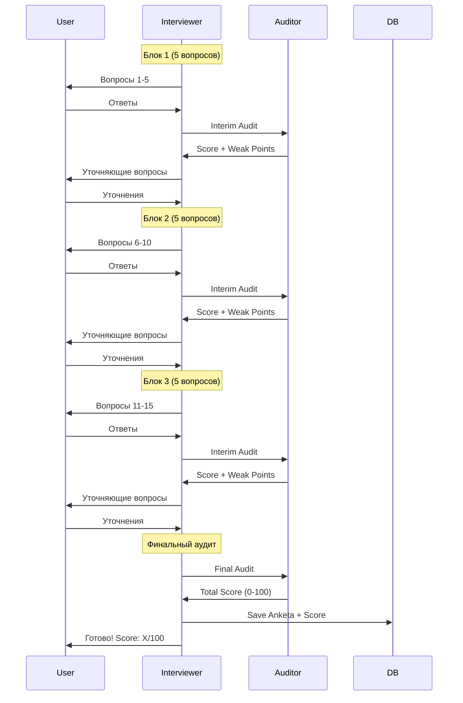

# 🎤 Архитектура Агента-Интервьюера GrantService

**Дата создания:** 2025-10-22
**Статус:** Полный обзор всех версий
**Автор:** Project Orchestrator Agent

---

## 📚 Оглавление
1. [Обзор версий](#обзор-версий)
2. [Методология интервьюирования](#методология)
3. [Архитектура V1 (Production)](#архитектура-v1)
4. [Архитектура V2 (In Development)](#архитектура-v2)
5. [Концепция Adaptive (Planned)](#концепция-adaptive)
6. [Функционал и возможности](#функционал)
7. [Интеграции](#интеграции)
8. [Сравнение версий](#сравнение)

---

## 📦 Обзор версий

### Существующие реализации:

```yaml
interviewer_agent.py:
  Lines: 624
  Status: Legacy
  Purpose: Генерация вопросов (ТОЛЬКО интерактивный режим)
  LLM: UnifiedLLMClient
  Audit: ❌ Нет

interactive_interviewer_agent.py:
  Lines: 675
  Status: ✅ PRODUCTION (текущая версия)
  Purpose: Интервью с промежуточными аудитами
  LLM: Claude Code / GigaChat
  Audit: ✅ Встроенный (3 промежуточных + финальный)

interactive_interviewer_agent_v2.py:
  Lines: 534
  Status: 🔄 IN DEVELOPMENT
  Purpose: Reference Points Framework + Qdrant
  LLM: Claude Code / GigaChat
  Audit: ✅ Адаптивный
  Qdrant: ✅ Интеграция с базой знаний ФПГ
```

### Запланированные:

```yaml
AdaptiveInterviewerAgent:
  Status: 📝 КОНЦЕПЦИЯ (BASE_RULES документ)
  Purpose: Адаптивный диалог со встроенным аудитом
  Approach: Темы вместо вопросов (12 тем)
  Features: Анализ = Аудит одновременно
```

---

## 🎯 Методология интервьюирования

### Философия подхода

#### ❌ **СТАРЫЙ подход** (interviewer_agent.py):
```
15 фиксированных вопросов → Анкета → Аудит отдельно
```

**Проблемы:**
- Жесткий сценарий (нет гибкости)
- Механический допрос (не учитывает контекст)
- Аудит только после всех вопросов
- Пользователь не знает что плохо до конца

#### ✅ **ТЕКУЩИЙ подход** (interactive_interviewer_agent.py):
```
3 блока по 5 вопросов
→ После каждого блока: Промежуточный аудит
→ Уточняющие вопросы на основе аудита
→ Финальный аудит
```

**Преимущества:**
- Промежуточная обратная связь
- Уточнения по ходу
- Пользователь видит прогресс
- Качество анкеты выше

#### 🚀 **БУДУЩИЙ подход** (AdaptiveInterviewerAgent - концепция):
```
12 тем (не вопросов!)
→ Адаптивная глубина по каждой теме
→ Анализ = Аудит одновременно
→ От 15 до 30 вопросов в зависимости от качества ответов
```

**Цель:**
- Естественный диалог (как с консультантом)
- Анкета готова сразу (без переделок)
- Экономия LLM вызовов
- Не нужен отдельный AuditorAgent

---

## 🏗️ Архитектура V1 (Production)

### Файл: `interactive_interviewer_agent.py`

### Структура интервью:

```python
INTERVIEW_QUESTIONS = {
    "block_1": [  # Базовая информация (5 вопросов)
        "Как называется ваш проект?",
        "Какова основная цель?",
        "Какую проблему решает?",
        "Кто целевая аудитория?",
        "В каком регионе?"
    ],
    "block_2": [  # Методология и бюджет (5 вопросов)
        "Какие задачи?",
        "Опишите методологию",
        "Какие результаты?",
        "Каков бюджет?",
        "Расшифруйте бюджет"
    ],
    "block_3": [  # Команда, партнёры, риски (5 вопросов)
        "Опишите команду",
        "Есть ли партнёры?",
        "Какие риски?",
        "Как проект будет работать после гранта?",
        "На какой срок?"
    ]
}
```

### Процесс интервью:



### Ключевые методы:

#### 1. `conduct_interview_with_audit(user_data)`
**Главный метод** - проводит полное интервью

**Input:**
```python
user_data = {
    'telegram_id': 12345,
    'username': '@user',
    'email': 'user@example.com',
    'phone': '+7...',
    'grant_fund': 'Фонд президентских грантов'
}
```

**Output:**
```python
{
    'status': 'success',
    'anketa': {...},  # 24 поля
    'anketa_id': 'AN-20251022-project-123',
    'audit_score': 75,  # 0-100
    'audit_details': {...},
    'recommendations': [...],
    'interactive_feedback': [
        {
            'block': 1,
            'audit_score': 7,
            'clarifications': {...}
        },
        # ... блоки 2, 3
    ],
    'processing_time': 120.5,
    'timestamp': '2025-10-22T...'
}
```

#### 2. `_interim_audit(partial_anketa, block_num)`
**Промежуточный аудит** после блока

**Промпт:**
```python
"""
Проведи быстрый аудит ответов на вопросы блока {block_num}.

Данные проекта:
{partial_anketa}

Оцени качество ответов по шкале 1-10 и укажи, что нужно уточнить.

Верни JSON:
{
    "partial_score": 7,
    "weak_points": ["бюджет не расшифрован"],
    "clarification_needed": [
        {"topic": "бюджет", "question": "Расшифруйте статьи конкретно"}
    ]
}
"""
```

**LLM вызов:**
```python
response = await self.llm_client.generate_async(
    prompt=audit_prompt,
    temperature=0.3,  # Низкая для точности
    max_tokens=500
)
```

#### 3. `_ask_clarifying_questions(audit_result, block_num)`
**Уточняющие вопросы** на основе аудита

**Логика:**
- Берет `clarification_needed` из аудита
- Генерирует вопросы для уточнения слабых мест
- Ограничение: макс 3 уточняющих вопроса на блок

#### 4. `_final_audit(complete_anketa)`
**Финальный комплексный аудит**

**Использует:** AuditorAgent (отдельный агент)

```python
final_audit = await self.auditor.audit_application_async(
    anketa_data=complete_anketa
)
```

**Возвращает:**
```python
{
    'overall_score': 0.75,  # 0-1
    'total_score': 75,      # 0-100
    'criteria_scores': {
        'relevance': 8,
        'innovation': 7,
        'feasibility': 8,
        'team': 6,
        'budget': 7,
        'sustainability': 7,
        'social_impact': 8,
        'measurability': 7,
        'risks': 6,
        'uniqueness': 7
    },
    'recommendations': [
        "Уточните бюджет...",
        "Опишите команду детальнее..."
    ],
    'recommendation': 'APPROVE_WITH_CHANGES'
}
```

### Маппинг данных:

**Анкета (24 поля):**
```python
anketa = {
    # Базовые (блок 1)
    'project_name': str,
    'project_goal': str,
    'problem_statement': str,
    'target_audience': str,
    'geography': str,

    # Методология (блок 2)
    'project_tasks': str,
    'methodology': str,
    'expected_results': str,
    'budget': str,
    'budget_breakdown': str,

    # Команда (блок 3)
    'team_description': str,
    'partners': str,
    'risks': str,
    'sustainability': str,
    'project_duration': str,

    # Метаданные
    'telegram_id': int,
    'username': str,
    'email': str,
    'phone': str,
    'grant_fund': str,
    'created_at': datetime,

    # Аудит
    'audit_score': int,      # 0-100
    'audit_details': dict,
    'recommendations': list
}
```

---

## 🚀 Архитектура V2 (In Development)

### Файл: `interactive_interviewer_agent_v2.py`

### Концепция: **Reference Points Framework**

#### Что такое Reference Points (RP)?

**Reference Point** - это не вопрос, а **ключевая информация** которую нужно собрать.

**Пример:**
```python
RP_PROBLEM_STATEMENT = {
    "id": "problem",
    "name": "Описание проблемы",
    "priority": "P0",  # Критичная
    "required_fields": [
        "description",     # Что за проблема
        "scale",           # Масштаб (сколько людей)
        "affected_people", # Кто затронут
        "root_cause"       # Корневая причина (опц)
    ],
    "min_quality": 7,  # Минимум 7/10
    "max_questions": 5 # Макс вопросов по теме
}
```

#### Адаптивная генерация вопросов:

```python
class AdaptiveQuestionGenerator:
    """
    Генерирует вопросы на основе:
    - Reference Point (что нужно узнать)
    - Текущих данных (что уже знаем)
    - Контекста из Qdrant (требования ФПГ)
    """

    async def generate_next_question(
        self,
        rp: ReferencePoint,
        current_data: dict,
        context_from_qdrant: list
    ) -> str:
        """
        Генерирует ОДИН следующий вопрос

        Учитывает:
        - Что уже спрошено
        - Что пользователь уже ответил
        - Какие поля RP еще не заполнены
        - Контекст из базы знаний ФПГ
        """
```

#### State Machine (Конечный автомат):

```python
class ConversationState(Enum):
    INIT = "init"              # Приветствие
    EXPLORING = "exploring"    # Исследование проекта
    DEEPENING = "deepening"    # Углубление в слабые места
    VALIDATING = "validating"  # Валидация понимания
    FINALIZING = "finalizing"  # Завершение
    COMPLETED = "completed"    # Готово
```

**Переходы между состояниями:**
```python
INIT → EXPLORING (всегда)
EXPLORING → DEEPENING (если есть слабые RP)
EXPLORING → VALIDATING (если все RP ≥ min_quality)
DEEPENING → VALIDATING (после уточнений)
VALIDATING → FINALIZING (подтверждение)
FINALIZING → COMPLETED (сохранение)
```

#### Интеграция с Qdrant:

```python
class InteractiveInterviewerAgentV2:
    def __init__(self, qdrant_host="5.35.88.251", qdrant_port=6333):
        # Подключение к векторной БД
        self.qdrant_client = QdrantClient(
            host=qdrant_host,
            port=qdrant_port
        )
        self.collection_name = "knowledge_sections"

    async def get_relevant_context(self, topic: str) -> List[str]:
        """
        Получить релевантный контекст из базы знаний ФПГ

        Example:
            topic = "бюджет проекта"
            → Qdrant поиск
            → Top 3 релевантных раздела ФПГ
            → Контекст для генерации вопроса
        """
        from sentence_transformers import SentenceTransformer

        # Generate embedding
        model = SentenceTransformer("paraphrase-multilingual-MiniLM-L12-v2")
        query_embedding = model.encode(topic)

        # Search in Qdrant
        results = self.qdrant_client.search(
            collection_name=self.collection_name,
            query_vector=query_embedding.tolist(),
            limit=3
        )

        # Extract context
        context = [hit.payload['content'] for hit in results]
        return context
```

#### Бюджет уточняющих вопросов:

```python
MAX_CLARIFYING_QUESTIONS = 5  # Всего
MAX_QUESTIONS_PER_RP = 5      # На одну тему

# Защита от зацикливания
if clarifying_budget_used >= MAX_CLARIFYING_QUESTIONS:
    # Переходим к финализации, даже если не всё идеально
    transition_to_state(ConversationState.FINALIZING)
```

#### Reference Points Manager:

```python
class ReferencePointManager:
    """
    Управляет всеми Reference Points
    """

    def get_priority_rp(self) -> ReferencePoint:
        """
        Возвращает следующий RP по приоритету

        Логика:
        1. P0 (критичные) - всегда первые
        2. P1 (важные) - после P0
        3. P2 (желательные) - если время есть
        4. P3 (опциональные) - пропускаем если бюджет исчерпан
        """

    def get_incomplete_rps(self) -> List[ReferencePoint]:
        """
        Возвращает RP с quality < min_quality
        """

    def calculate_overall_completeness(self) -> float:
        """
        Общая полнота интервью (0-1)
        """
```

---

## 💡 Концепция Adaptive (Planned)

### Документ: `BASE_RULES_ADAPTIVE_INTERVIEWER.md`

### Главная идея:

```
АНАЛИЗ ОТВЕТА = ЭТО И ЕСТЬ АУДИТ

Не нужно:
- Отдельный AuditorAgent
- Промежуточные аудиты после блоков
- Этап "переделки" анкеты

Вместо этого:
- Анализируем каждый ответ сразу
- Решаем: достаточно или копать глубже
- Анкета готова сразу (качество ≥60/100)
```

### Архитектура:

```python
class AdaptiveInterviewerAgent(BaseAgent):
    """
    Умный интервьюер с встроенным аудитом
    """

    def __init__(self):
        # Темы вместо вопросов
        self.required_topics = {
            "problem": {"quality": 0, "min_quality": 7},
            "goal": {"quality": 0, "min_quality": 7},
            "target_audience": {"quality": 0, "min_quality": 7},
            "methodology": {"quality": 0, "min_quality": 7},
            "budget": {"quality": 0, "min_quality": 7},
            "team": {"quality": 0, "min_quality": 6},
            "partners": {"quality": 0, "min_quality": 6},
            "risks": {"quality": 0, "min_quality": 6},
            "results": {"quality": 0, "min_quality": 7},
            "sustainability": {"quality": 0, "min_quality": 6},
            "timeline": {"quality": 0, "min_quality": 6},
            "uniqueness": {"quality": 0, "min_quality": 6}
        }  # Всего 12 тем

    async def conduct_adaptive_interview(self, user_id):
        """
        Адаптивное интервью до полного покрытия тем
        """
        while not self._all_topics_covered():
            # 1. Выбрать тему (приоритет + недостающее качество)
            topic = self._choose_next_topic()

            # 2. Умный вопрос (учитывая контекст)
            question = await self._generate_contextual_question(topic)

            # 3. Ответ пользователя
            answer = await self._get_user_answer(question)

            # 4. АНАЛИЗ = АУДИТ одновременно
            analysis = await self._analyze_and_extract(topic, answer)

            # 5. Обновить состояние темы
            self._update_topic_state(topic, analysis)

            # 6. Решить: продолжить или переключиться
            if analysis['quality'] >= self.required_topics[topic]['min_quality']:
                # Тема готова
                continue
            elif self.conversation_state['topic_depth'] >= 5:
                # Слишком глубоко, переключаемся
                continue
            else:
                # Копаем дальше
                self.conversation_state['topic_depth'] += 1

    async def _analyze_and_extract(self, topic, answer):
        """
        КЛЮЧЕВОЙ МОМЕНТ: Анализ + Извлечение одновременно

        Не делаем отдельно аудит!
        Сразу в процессе анализа ответа.
        """
        prompt = f"""
Оцени ответ пользователя для темы "{topic}".

ВОПРОС: {self.conversation_state['last_question']}
ОТВЕТ: {answer}

АНАЛИЗ:
1. Какие поля заполнены?
2. Достаточно ли детализации?
3. Есть ли конкретика (цифры, факты)?
4. Что ещё нужно уточнить?

ФОРМАТ ОТВЕТА (JSON):
{{
    "quality": 7,  // 1-10
    "completeness": 0.8,
    "extracted_data": {{
        "field1": "...",
        "field2": "..."
    }},
    "missing_info": ["..."],
    "needs_clarification": true,
    "next_focus": "уточни масштаб проблемы"
}}
"""

        response = await self.llm_client.generate_async(
            prompt,
            temperature=0.2  # Низкая для точности
        )

        return json.loads(response['content'])
```

### Преимущества:

```yaml
Качество анкеты:
  Было: 65/100 (требует правок)
  Стало: 80/100 (сразу готова)

Время:
  Было: 10 мин + 5 мин правки = 15 мин
  Стало: 12-18 мин (без правок)

LLM вызовы:
  Было: 15 + 4 аудита = 19 вызовов
  Стало: 15-20 вызовов (НО без дублирования контекста)

UX оценка:
  Было: 3/5 (механический допрос)
  Стало: 4.5/5 (живой диалог)

Процент завершений:
  Было: 70% (бросают на правках)
  Стало: 85% (нет правок)
```

---

## 🎛️ Функционал и возможности

### Общий функционал (все версии):

#### 1. **Сбор данных анкеты**
- 24 поля стандартной анкеты
- Валидация обязательных полей
- Сохранение в БД

#### 2. **Интеграция с LLM**
- UnifiedLLMClient (поддержка Claude Code и GigaChat)
- Гибкая смена провайдера
- Fallback при ошибках

#### 3. **Database Prompt Manager**
```python
# Загрузка промптов из БД (таблица agent_prompts)
prompt = self.prompt_manager.get_prompt(
    agent_type='interactive_interviewer',
    prompt_type='block_audit',
    variables={'block_num': 1, 'answers': '...'}
)

# Версионирование промптов
# Возможность A/B тестирования
# Обновление без изменения кода
```

#### 4. **Error Handling**
```python
try:
    response = await self.llm_client.generate_async(...)
except Exception as e:
    logger.error(f"LLM error: {e}")
    # Fallback: базовая оценка
    return default_result
```

### Специфичный функционал V1:

#### 1. **Промежуточные аудиты (3 раза)**
- После блока 1 (вопросы 1-5)
- После блока 2 (вопросы 6-10)
- После блока 3 (вопросы 11-15)

#### 2. **Уточняющие вопросы**
- На основе weak_points из аудита
- Макс 3 вопроса на блок
- Сохраняются в interactive_feedback

#### 3. **Финальный комплексный аудит**
- Использует AuditorAgent
- 10 критериев оценки
- Рекомендации по улучшению

### Специфичный функционал V2:

#### 1. **Reference Points Framework**
- Адаптивная приоритизация информации
- P0-P3 уровни приоритета
- Гибкость в сборе данных

#### 2. **Интеграция с Qdrant**
- Семантический поиск по базе знаний ФПГ
- Контекст для генерации вопросов
- 384d векторы (multilingual-MiniLM)

#### 3. **State Machine**
- 6 состояний диалога
- Умные переходы
- Естественный flow

#### 4. **Бюджет вопросов**
- Макс 5 уточняющих
- Защита от зацикливания
- Прогресс-бар для пользователя

---

## 🔗 Интеграции

### LLM Providers:

```python
# Claude Code API
provider = "claude_code"
model = "claude-sonnet-4-5"
temperature = 0.3  # Для аудита (точность)
temperature = 0.7  # Для вопросов (креативность)

# GigaChat API
provider = "gigachat"
model = "GigaChat-Pro"
temperature = 0.6
```

### Database:

```python
# PostgreSQL
tables = [
    'users',           # Пользователи
    'sessions',        # Сессии интервью
    'anketas',         # Готовые анкеты
    'agent_prompts',   # Промпты из БД
    'audit_scores'     # Оценки аудита
]

# Сохранение анкеты
anketa_id = await self._save_anketa_to_db(anketa, audit)
# Формат: AN-20251022-project_name-123
```

### Qdrant (V2):

```python
# Vector Database
host = "5.35.88.251"
port = 6333
collection = "knowledge_sections"

# 31 раздел требований ФПГ
# 384d векторы
# Семантический поиск

# Usage
context = await self.get_relevant_context("бюджет проекта")
# → Top 3 релевантных раздела из базы знаний
```

### Telegram Bot:

```python
# Интеграция через handlers
from telegram-bot.handlers import interactive_interview_handler

# Использование
agent = InteractiveInterviewerAgent(db, llm_provider="claude_code")
result = await agent.conduct_interview_with_audit(user_data)

# Отправка результата пользователю
await bot.send_message(
    chat_id=user_id,
    text=f"✅ Интервью завершено!\n"
         f"Ваша оценка: {result['audit_score']}/100\n"
         f"Анкета ID: {result['anketa_id']}"
)
```

---

## 📊 Сравнение версий

| Критерий | Legacy (old) | V1 (Production) | V2 (Development) | Adaptive (Concept) |
|----------|--------------|-----------------|------------------|--------------------|
| **Строк кода** | 624 | 675 | 534 | ~800 (планируется) |
| **Статус** | Legacy | ✅ Production | 🔄 Development | 📝 Concept |
| **Вопросы** | 15 фиксированных | 15 + уточняющие | Адаптивно | 15-30 адаптивно |
| **Аудит** | ❌ Нет | ✅ 3 промежуточных + финальный | ✅ Адаптивный | ✅ Встроенный (каждый ответ) |
| **Уточнения** | ❌ Нет | ✅ До 3 на блок | ✅ До 5 всего | ✅ Неограниченно (до качества) |
| **Структура** | Блоки вопросов | 3 блока по 5 | Reference Points | 12 тем |
| **LLM вызовы** | ~15 | ~25-30 | ~20-25 | ~15-20 (эффективнее) |
| **Qdrant** | ❌ | ❌ | ✅ | ✅ |
| **State Machine** | ❌ | ❌ | ✅ | ✅ |
| **Качество анкеты** | 50-60/100 | 65/100 | 70-75/100 | 80/100 (цель) |
| **Время** | 10 мин | 15 мин | 12-18 мин | 12-18 мин |
| **UX оценка** | 2/5 | 3/5 | 4/5 | 4.5/5 (цель) |
| **Завершаемость** | 60% | 70% | 80% | 85% (цель) |
| **Сложность кода** | Простая | Средняя | Высокая | Очень высокая |
| **Поддержка** | Легко | Средне | Сложно | Сложно |

---

## 🎯 Рекомендации

### Для Production (сейчас):
✅ **Используйте V1** (`interactive_interviewer_agent.py`)
- Проверен в бою
- Стабилен
- Понятная архитектура
- Хорошее качество (65/100)

### Для Development (следующий этап):
🔄 **Доработайте V2** (`interactive_interviewer_agent_v2.py`)
- Добавьте полную интеграцию с Qdrant
- Протестируйте Reference Points
- Сравните с V1 (A/B тест)
- Если V2 > V1 → переход на V2

### Для будущего (через 2-3 месяца):
📝 **Реализуйте Adaptive** (концепция)
- Самый высокий потенциал
- Лучший UX
- Экономия LLM
- Но сложнее в реализации

---

## 📝 Известные проблемы

### V1 (Production):

#### 1. **AuditorAgent возвращает 0/100**
```
Status: ⚠️ КРИТИЧЕСКИЙ БАГ
File: auditor_agent.py
Issue: final_audit возвращает overall_score=0
Impact: Пользователи не видят реальную оценку
Fix: Проверить промпты в БД + валидацию JSON
```

#### 2. **Hardcoded вопросы**
```
Status: ⚠️ Ограничение
Issue: 15 фиксированных вопросов в коде
Impact: Нет гибкости
Fix: V2 (Reference Points) или Adaptive (темы)
```

#### 3. **Нет контекста ФПГ**
```
Status: ⚠️ Упущенная возможность
Issue: Не использует базу знаний из Qdrant
Impact: Вопросы могут не соответствовать требованиям
Fix: V2 с интеграцией Qdrant
```

### V2 (Development):

#### 1. **Не полностью реализован**
```
Status: 🔄 В разработке
Missing:
  - Полная интеграция Qdrant
  - State Machine transitions
  - Тестирование
```

#### 2. **Сложность**
```
Status: ⚠️ Риск
Issue: Высокая сложность кода
Impact: Труднее поддерживать
Mitigation: Хорошая документация + тесты
```

---

## 🚀 Дальнейшее развитие

### Краткосрочно (1-2 недели):
1. ✅ **Исправить AuditorAgent bug** (V1)
2. ✅ **Завершить V2** (Reference Points)
3. ✅ **A/B тест V1 vs V2**

### Среднесрочно (1-2 месяца):
4. 📝 **Реализовать Adaptive** (концепция)
5. 📝 **RL для оптимизации** (обучение на успешных заявках)
6. 📝 **Персонализация** (адаптация под тип проекта)

### Долгосрочно (3-6 месяцев):
7. 🔮 **Multi-modal** (анализ презентаций, документов)
8. 🔮 **Голосовое интервью** (интеграция с voice AI)
9. 🔮 **Автономный советник** (проактивные рекомендации)

---

## 📚 Ссылки на код

```yaml
Production:
  - agents/interactive_interviewer_agent.py (675 строк)
  - agents/auditor_agent.py (интеграция)

Development:
  - agents/interactive_interviewer_agent_v2.py (534 строки)
  - agents/reference_points.py (фреймворк)
  - agents/reference_points/adaptive_question_generator.py

Legacy:
  - agents/interviewer_agent.py (624 строки)

Docs:
  - 00_Project_Info/AI_AGENTS.md
  - 01_Projects/.../BASE_RULES_ADAPTIVE_INTERVIEWER.md
  - 01_Projects/.../INTERACTIVE_INTERVIEWER_TEST_REPORT.md

Tests:
  - tests/integration/test_archery_club_fpg_e2e.py
  - telegram-bot/tests/unit/test_interview_agent.py
```

---

**Создано:** 2025-10-22
**Автор:** Project Orchestrator Agent
**Версия:** 1.0
**Статус:** ✅ Complete Overview
