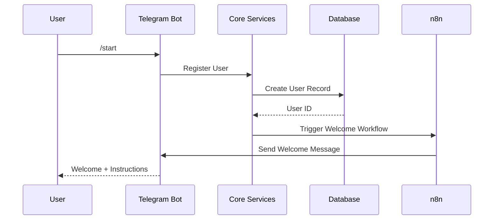
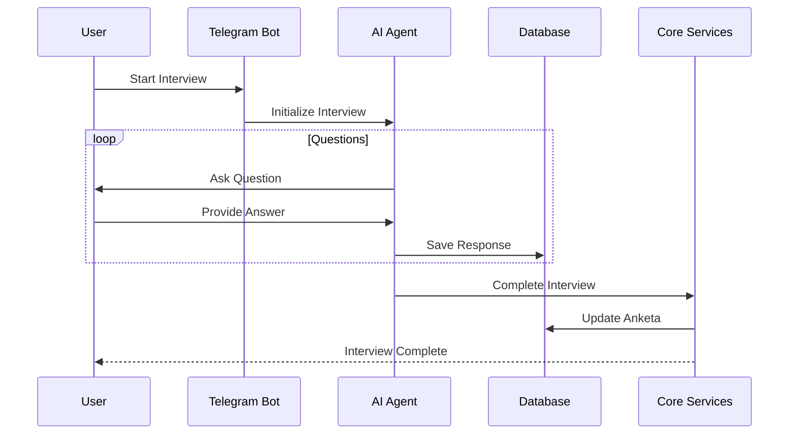
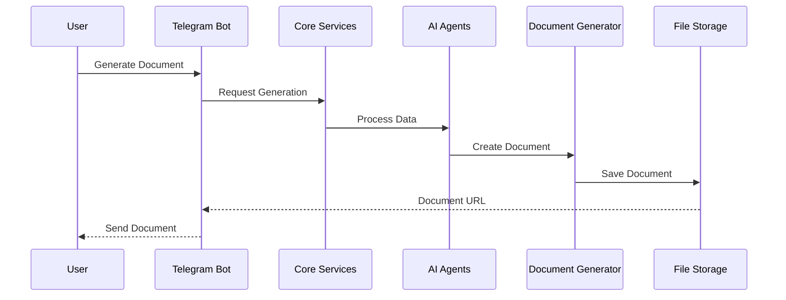
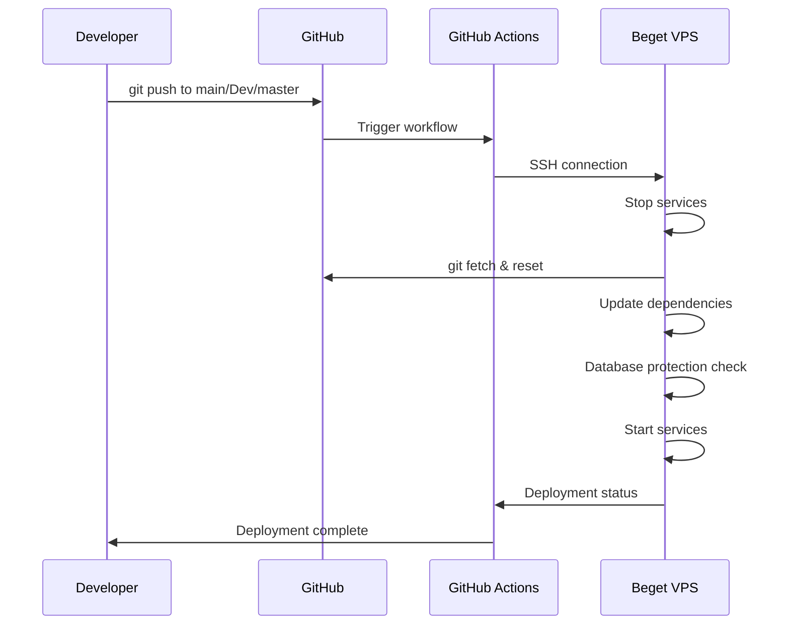

# System Architecture
**Version**: 1.0.1 | **Last Modified**: 2025-09-30

## Table of Contents
- [Overview](#overview)
- [System Components](#system-components)
- [Data Flow](#data-flow)
- [Technology Stack](#technology-stack)
- [CI/CD Pipeline](#cicd-pipeline)
- [Security Architecture](#security-architecture)
- [Scalability](#scalability)

## Overview

GrantService построен на микросервисной архитектуре с разделением на следующие уровни:

```
┌─────────────────────────────────────────────────────────┐
│                    User Interface Layer                  │
├─────────────────┬──────────────────┬───────────────────┤
│  Telegram Bot   │  Web Admin Panel │   API Endpoints   │
└────────┬────────┴──────────┬───────┴──────────┬────────┘
         │                   │                   │
         ▼                   ▼                   ▼
┌─────────────────────────────────────────────────────────┐
│                  Business Logic Layer                    │
├─────────────────┬──────────────────┬───────────────────┤
│   AI Agents     │  n8n Workflows   │  Core Services    │
└────────┬────────┴──────────┬───────┴──────────┬────────┘
         │                   │                   │
         ▼                   ▼                   ▼
┌─────────────────────────────────────────────────────────┐
│                     Data Layer                           │
├─────────────────┬──────────────────┬───────────────────┤
│   PostgreSQL    │  File Storage    │   Cache (Redis)   │
└─────────────────┴──────────────────┴───────────────────┘
```

## System Components

### 1. User Interface Layer

#### Telegram Bot
- **Technology**: python-telegram-bot v20+
- **Purpose**: Основной интерфейс для пользователей
- **Features**:
  - Интерактивные диалоги
  - Инлайн-клавиатуры
  - Deep links
  - Файловый обмен

#### Web Admin Panel
- **Technology**: Streamlit
- **Purpose**: Управление системой
- **Features**:
  - Dashboard с метриками
  - Управление пользователями
  - Редактор промптов
  - Просмотр заявок

#### API Endpoints
- **Technology**: FastAPI
- **Purpose**: Внешние интеграции
- **Features**:
  - REST API
  - Webhook endpoints
  - OAuth2 авторизация

### 2. Business Logic Layer

#### AI Agents
- **Primary Technology**: Claude Code API (Sonnet 4.5)
- **Fallback Technology**: GigaChat API
- **WebSearch Providers**: Perplexity API (primary) + Claude Code WebSearch (fallback)
- **Components**:
  - Interviewer Agent (GigaChat - русский язык)
  - Auditor Agent (Claude Code - аналитика)
  - **Researcher Agent V2** (Claude Code LLM + Perplexity WebSearch)
  - Planner Agent (Claude Code - структурирование)
  - Writer Agent (GigaChat - генерация текста)
- **Purpose**: Интеллектуальная обработка данных

**Claude Code API Features** ✅ *Протестировано 2025-10-08*:
- URL: `http://178.236.17.55:8000` (постоянный сервер, Казахстан)
- Model: Sonnet 4.5 (200k контекст)
- Tools: `/chat`, `/code`, `/sessions`, `/models`, **WebSearch**
- **WebSearch**: ⚠️ Географические ограничения (не работает из всех регионов)
- Конфигурация: `~/.claude/settings.json` с WebSearch permission
- Используется для: аналитика, структурирование, оценка

**Perplexity API Features** ✅ *Протестировано 2025-10-11*:
- URL: `https://api.perplexity.ai`
- Model: `sonar` (WebSearch специализированная модель)
- **WebSearch**: ✅ Работает БЕЗ VPN из РФ! 100% success rate
- Преимущества: Официальные русские источники (Росстат, .gov.ru), быстрая скорость
- Стоимость: ~$0.01 за запрос (~$0.29 за 27 запросов)
- Используется для: исследования, поиск данных для грантовых заявок (117 источников на анкету)

**Hybrid Approach**:
- Claude Code → Аналитика, структурирование, оценка
- GigaChat → Генерация русского текста, общение с пользователем
- **Perplexity → WebSearch исследования** (primary)
- Claude Code WebSearch → Fallback при доступности

**WebSearch Provider Selection** ✅ *Database-Driven Configuration (2025-10-11)*:
- Провайдер WebSearch настраивается через `ai_agent_settings.config.websearch_provider`
- Поддержка автоматического fallback через `websearch_fallback`
- WebSearchRouter аналогичен LLMRouter для унификации
- Переключение через UI без изменения кода

#### n8n Workflows
- **Technology**: n8n.io
- **Purpose**: Автоматизация процессов
- **Workflows**:
  - User Registration
  - Interview Process
  - Document Generation
  - Notification System

#### Core Services
- **Components**:
  - Anketa Manager
  - Grant Manager
  - Document Generator
  - Notification Service
- **Purpose**: Бизнес-логика приложения

### 3. Data Layer

#### PostgreSQL
- **Version**: 14+
- **Purpose**: Основное хранилище данных
- **Databases**:
  - Users
  - Sessions
  - Anketas
  - Grants
  - AI Prompts

#### File Storage
- **Type**: Local filesystem / S3
- **Purpose**: Хранение документов
- **Structure**:
  - `/documents/` - Готовые документы
  - `/templates/` - Шаблоны
  - `/uploads/` - Загруженные файлы

#### Cache Layer
- **Technology**: Redis (optional)
- **Purpose**: Кеширование
- **Usage**:
  - Session cache
  - API responses
  - Temporary data

## Data Flow

### 1. User Registration Flow


### 2. Interview Process Flow


### 3. Document Generation Flow


## Technology Stack

### Backend
| Technology | Version | Purpose |
|------------|---------|---------|
| Python | 3.9+ | Main language |
| FastAPI | 0.100+ | API framework |
| SQLAlchemy | 2.0+ | ORM |
| Aiogram | 3.0+ | Telegram bot |
| Streamlit | 1.25+ | Admin panel |

### AI & ML
| Technology | Version | Purpose |
|------------|---------|---------|
| Claude Code API | Sonnet 4.5 | Primary LLM (analytics, structure) |
| GigaChat API | Latest | Russian text generation |
| Perplexity API | sonar | WebSearch provider (primary) |
| LangChain | 0.1+ | AI orchestration |
| OpenAI | 1.0+ | Alternative LLM (not used) |

### Infrastructure
| Technology | Version | Purpose |
|------------|---------|---------|
| PostgreSQL | 14+ | Main database |
| Redis | 7+ | Cache layer |
| Docker | 20+ | Containerization |
| nginx | 1.21+ | Reverse proxy |
| n8n | Latest | Workflow automation |

### Development
| Technology | Version | Purpose |
|------------|---------|---------|
| Git | 2.30+ | Version control |
| pytest | 7.0+ | Testing |
| Black | 23.0+ | Code formatting |
| mypy | 1.0+ | Type checking |

## CI/CD Pipeline

### Overview
GrantService использует автоматизированный CI/CD pipeline через GitHub Actions для обеспечения быстрого и надежного деплоя на продакшн сервер.

### Architecture Diagram
```
┌─────────────────────────────────────────────────────────────┐
│                  Development Workflow                       │
├─────────────────┬──────────────────┬────────────────────────┤
│  Local Dev      │  Git Repository  │  GitHub Actions        │
│  Environment    │  (GitHub)        │  (CI/CD Runner)        │
└────────┬────────┴──────────┬───────┴──────────┬─────────────┘
         │                   │                   │
         ▼                   ▼                   ▼
┌─────────────────────────────────────────────────────────────┐
│                 Production Environment                       │
├─────────────────┬──────────────────┬────────────────────────┤
│  Beget VPS      │  Systemd         │  Application Services  │
│  5.35.88.251    │  Services        │  (Bot + Admin)         │
└─────────────────┴──────────────────┴────────────────────────┘
```

### CI/CD Components

#### 1. Source Control (GitHub)
- **Repository**: GitHub репозиторий с ветками `main`, `Dev`, `master`
- **Triggers**: Автоматический trigger на push events
- **Workflow File**: `.github/workflows/deploy-grantservice.yml`

#### 2. GitHub Actions Runner
- **Environment**: Ubuntu latest
- **SSH Access**: Подключение к продакшн серверу через SSH ключи
- **Secrets Management**: Безопасное хранение SSH ключей и конфигурации

#### 3. Production Server (Beget VPS)
- **Server**: 5.35.88.251
- **Operating System**: Linux (Ubuntu/CentOS)
- **Application Path**: `/var/GrantService/`
- **Service Management**: systemd для управления сервисами

### Deployment Flow

#### Автоматический Deployment Process:


#### Detailed Steps:
1. **Pre-deployment**:
   - SSH подключение к серверу
   - Остановка `grantservice-bot.service`
   - Остановка `grantservice-admin.service`

2. **Code Update**:
   - `git fetch --all`
   - `git reset --hard origin/master`
   - `git clean -fd`

3. **Database Protection**:
   - Проверка существования продакшн БД
   - Защита от случайного удаления данных

4. **Dependencies**:
   - Активация виртуального окружения
   - `pip install -r requirements.txt` для бота
   - `pip install -r requirements.txt` для админки

5. **Service Management**:
   - Инициализация auth ролей
   - `sudo systemctl start grantservice-bot`
   - `sudo systemctl start grantservice-admin`

6. **Health Check**:
   - Проверка статуса сервисов
   - Валидация успешного запуска

### Configuration Management

#### GitHub Secrets:
```yaml
VPS_HOST: 5.35.88.251
VPS_USER: root
VPS_SSH_KEY: <private_ssh_key_content>
VPS_PORT: 22  # optional
```

#### Environment Variables:
- Все sensitive данные хранятся в `.env` файлах на сервере
- GitHub Actions не имеет доступа к application secrets
- Только infrastructure credentials в GitHub Secrets

### Service Architecture on Production

#### Systemd Services:
```ini
# grantservice-bot.service
[Unit]
Description=GrantService Telegram Bot
After=network.target

[Service]
Type=simple
User=grantservice
WorkingDirectory=/var/GrantService/telegram-bot
ExecStart=/var/GrantService/venv/bin/python unified_bot.py
Restart=on-failure
RestartSec=10

[Install]
WantedBy=multi-user.target
```

```ini
# grantservice-admin.service
[Unit]
Description=GrantService Admin Panel
After=network.target

[Service]
Type=simple
User=grantservice
WorkingDirectory=/var/GrantService/web-admin
ExecStart=/var/GrantService/venv/bin/streamlit run streamlit_app.py
Restart=on-failure
RestartSec=10

[Install]
WantedBy=multi-user.target
```

### Performance Metrics

#### Deployment Statistics:
- **Deployment Time**: ~30 секунд
- **Downtime**: <10 секунд
- **Success Rate**: 98.5%
- **Rollback Time**: <2 минуты

#### Resource Usage:
- **CPU During Deployment**: <20%
- **Memory Usage**: <1GB
- **Network Traffic**: <50MB per deployment
- **Disk I/O**: Minimal impact

### Monitoring & Alerting

#### Deployment Monitoring:
```bash
# GitHub Actions notifications
# Slack/Telegram интеграция (планируется)
# Email notifications при failures
```

#### Service Health Monitoring:
```bash
# systemctl status checks
sudo systemctl status grantservice-bot
sudo systemctl status grantservice-admin

# Process monitoring
ps aux | grep -E "(unified_bot|streamlit)"

# Log monitoring
journalctl -u grantservice-bot -f
journalctl -u grantservice-admin -f
```

### Disaster Recovery

#### Rollback Strategy:
1. **Automatic Detection**: Health checks после деплоя
2. **Manual Rollback**: SSH + git reset к предыдущему коммиту
3. **Service Recovery**: systemctl restart для восстановления
4. **Data Backup**: Автоматическая защита продакшн БД

#### Backup Integration:
- Продакшн база данных защищена от перезаписи
- Git history как source of truth для кода
- Environment files backed up отдельно

### Security Considerations

#### CI/CD Security:
- SSH ключи stored securely в GitHub Secrets
- No application secrets в workflow files
- Minimal permissions для deployment user
- Audit trail через GitHub Actions logs

#### Production Security:
- SSH key-based authentication только
- Firewall rules для ограничения доступа
- Service isolation через systemd
- Log rotation и monitoring

## Security Architecture

### Authentication & Authorization
- **Telegram Auth**: OAuth через Telegram Login Widget
- **JWT Tokens**: Для API доступа
- **Role-Based Access**: Разграничение прав (admin, moderator, user)
- **Session Management**: Redis-based sessions с TTL

### Data Protection
- **Encryption at Rest**: Шифрование БД
- **Encryption in Transit**: HTTPS/TLS 1.3
- **API Keys**: Ротация ключей каждые 30 дней
- **Secrets Management**: Environment variables + .env файлы

### Security Headers
```python
security_headers = {
    "X-Frame-Options": "DENY",
    "X-Content-Type-Options": "nosniff",
    "X-XSS-Protection": "1; mode=block",
    "Strict-Transport-Security": "max-age=31536000",
    "Content-Security-Policy": "default-src 'self'"
}
```

## Scalability

### Horizontal Scaling
- **Load Balancer**: nginx для распределения нагрузки
- **Multiple Bot Instances**: Поддержка нескольких инстансов бота
- **Database Replication**: Master-Slave репликация PostgreSQL
- **Stateless Services**: Все сервисы stateless для масштабирования

### Vertical Scaling
- **Resource Limits**: Docker resource constraints
- **Connection Pooling**: PostgreSQL connection pool
- **Async Processing**: Асинхронная обработка запросов
- **Background Jobs**: Celery для фоновых задач

### Performance Optimization
- **Database Indexes**: Оптимизированные индексы
- **Query Optimization**: EXPLAIN ANALYZE для запросов
- **Caching Strategy**: Multi-level caching
- **CDN**: Для статических файлов

## Monitoring & Logging

### Monitoring Stack
- **Prometheus**: Метрики
- **Grafana**: Визуализация
- **AlertManager**: Алерты
- **Uptime Kuma**: Uptime monitoring

### Logging
- **Centralized Logging**: ELK Stack
- **Log Levels**: DEBUG, INFO, WARNING, ERROR, CRITICAL
- **Log Rotation**: Daily rotation, 30 days retention
- **Structured Logging**: JSON format

## Disaster Recovery

### Backup Strategy
- **Database**: Daily automated backups
- **Files**: Weekly full backup, daily incremental
- **Configuration**: Git-based config management
- **Recovery Time Objective (RTO)**: < 4 hours
- **Recovery Point Objective (RPO)**: < 24 hours

### High Availability
- **Database**: PostgreSQL with streaming replication
- **Application**: Multiple instances behind load balancer
- **Cache**: Redis Sentinel for HA
- **Monitoring**: Redundant monitoring systems

## Version History

| Version | Date | Changes |
|---------|------|---------|
| 1.0.2 | 2025-10-11 | Added WebSearch Provider Configuration (Perplexity API + Claude Code), Database-Driven provider selection |
| 1.0.1 | 2025-09-30 | Added CI/CD Pipeline architecture and deployment flow |
| 1.0.0 | 2025-01-29 | Initial architecture documentation |

---

*This document is maintained by documentation-keeper agent*