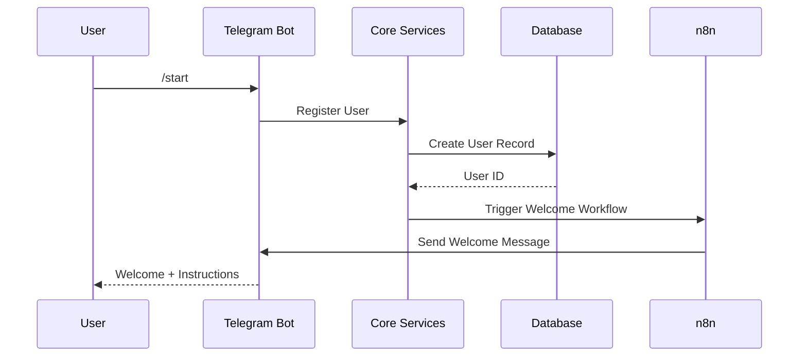
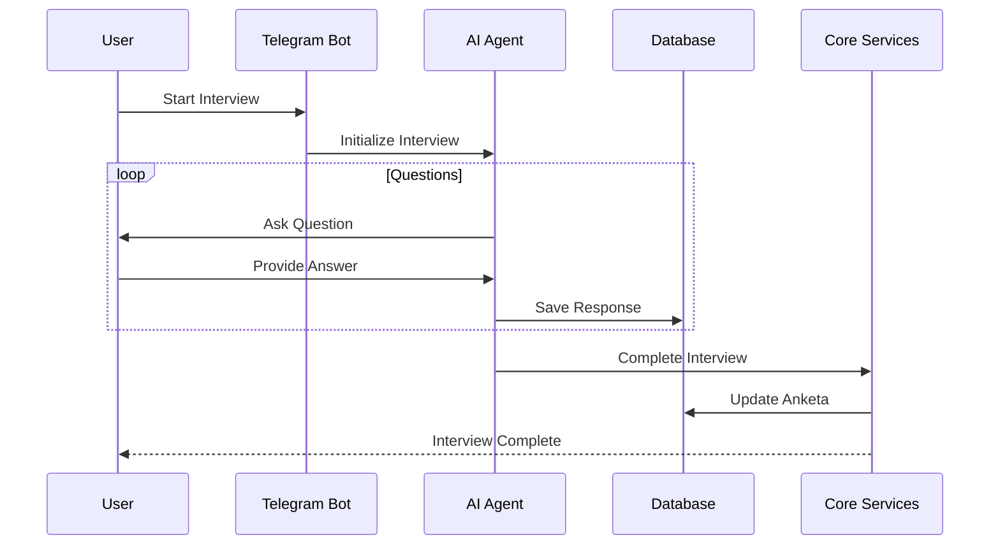
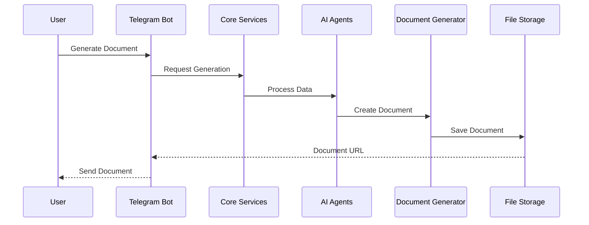

# System Architecture
**Version**: 1.0.0 | **Last Modified**: 2025-01-29

## Table of Contents
- [Overview](#overview)
- [System Components](#system-components)
- [Data Flow](#data-flow)
- [Technology Stack](#technology-stack)
- [Security Architecture](#security-architecture)
- [Scalability](#scalability)

## Overview

GrantService построен на микросервисной архитектуре с разделением на следующие уровни:

```
┌─────────────────────────────────────────────────────────┐
│                    User Interface Layer                  │
├─────────────────┬──────────────────┬───────────────────┤
│  Telegram Bot   │  Web Admin Panel │   API Endpoints   │
└────────┬────────┴──────────┬───────┴──────────┬────────┘
         │                   │                   │
         ▼                   ▼                   ▼
┌─────────────────────────────────────────────────────────┐
│                  Business Logic Layer                    │
├─────────────────┬──────────────────┬───────────────────┤
│   AI Agents     │  n8n Workflows   │  Core Services    │
└────────┬────────┴──────────┬───────┴──────────┬────────┘
         │                   │                   │
         ▼                   ▼                   ▼
┌─────────────────────────────────────────────────────────┐
│                     Data Layer                           │
├─────────────────┬──────────────────┬───────────────────┤
│   PostgreSQL    │  File Storage    │   Cache (Redis)   │
└─────────────────┴──────────────────┴───────────────────┘
```

## System Components

### 1. User Interface Layer

#### Telegram Bot
- **Technology**: python-telegram-bot v20+
- **Purpose**: Основной интерфейс для пользователей
- **Features**:
  - Интерактивные диалоги
  - Инлайн-клавиатуры
  - Deep links
  - Файловый обмен

#### Web Admin Panel
- **Technology**: Streamlit
- **Purpose**: Управление системой
- **Features**:
  - Dashboard с метриками
  - Управление пользователями
  - Редактор промптов
  - Просмотр заявок

#### API Endpoints
- **Technology**: FastAPI
- **Purpose**: Внешние интеграции
- **Features**:
  - REST API
  - Webhook endpoints
  - OAuth2 авторизация

### 2. Business Logic Layer

#### AI Agents
- **Technology**: GigaChat API
- **Components**:
  - Interviewer Agent
  - Auditor Agent
  - Planner Agent
  - Writer Agent
- **Purpose**: Интеллектуальная обработка данных

#### n8n Workflows
- **Technology**: n8n.io
- **Purpose**: Автоматизация процессов
- **Workflows**:
  - User Registration
  - Interview Process
  - Document Generation
  - Notification System

#### Core Services
- **Components**:
  - Anketa Manager
  - Grant Manager
  - Document Generator
  - Notification Service
- **Purpose**: Бизнес-логика приложения

### 3. Data Layer

#### PostgreSQL
- **Version**: 14+
- **Purpose**: Основное хранилище данных
- **Databases**:
  - Users
  - Sessions
  - Anketas
  - Grants
  - AI Prompts

#### File Storage
- **Type**: Local filesystem / S3
- **Purpose**: Хранение документов
- **Structure**:
  - `/documents/` - Готовые документы
  - `/templates/` - Шаблоны
  - `/uploads/` - Загруженные файлы

#### Cache Layer
- **Technology**: Redis (optional)
- **Purpose**: Кеширование
- **Usage**:
  - Session cache
  - API responses
  - Temporary data

## Data Flow

### 1. User Registration Flow


### 2. Interview Process Flow


### 3. Document Generation Flow


## Technology Stack

### Backend
| Technology | Version | Purpose |
|------------|---------|---------|
| Python | 3.9+ | Main language |
| FastAPI | 0.100+ | API framework |
| SQLAlchemy | 2.0+ | ORM |
| Aiogram | 3.0+ | Telegram bot |
| Streamlit | 1.25+ | Admin panel |

### AI & ML
| Technology | Version | Purpose |
|------------|---------|---------|
| GigaChat API | Latest | LLM processing |
| LangChain | 0.1+ | AI orchestration |
| OpenAI | 1.0+ | Alternative LLM |

### Infrastructure
| Technology | Version | Purpose |
|------------|---------|---------|
| PostgreSQL | 14+ | Main database |
| Redis | 7+ | Cache layer |
| Docker | 20+ | Containerization |
| nginx | 1.21+ | Reverse proxy |
| n8n | Latest | Workflow automation |

### Development
| Technology | Version | Purpose |
|------------|---------|---------|
| Git | 2.30+ | Version control |
| pytest | 7.0+ | Testing |
| Black | 23.0+ | Code formatting |
| mypy | 1.0+ | Type checking |

## Security Architecture

### Authentication & Authorization
- **Telegram Auth**: OAuth через Telegram Login Widget
- **JWT Tokens**: Для API доступа
- **Role-Based Access**: Разграничение прав (admin, moderator, user)
- **Session Management**: Redis-based sessions с TTL

### Data Protection
- **Encryption at Rest**: Шифрование БД
- **Encryption in Transit**: HTTPS/TLS 1.3
- **API Keys**: Ротация ключей каждые 30 дней
- **Secrets Management**: Environment variables + .env файлы

### Security Headers
```python
security_headers = {
    "X-Frame-Options": "DENY",
    "X-Content-Type-Options": "nosniff",
    "X-XSS-Protection": "1; mode=block",
    "Strict-Transport-Security": "max-age=31536000",
    "Content-Security-Policy": "default-src 'self'"
}
```

## Scalability

### Horizontal Scaling
- **Load Balancer**: nginx для распределения нагрузки
- **Multiple Bot Instances**: Поддержка нескольких инстансов бота
- **Database Replication**: Master-Slave репликация PostgreSQL
- **Stateless Services**: Все сервисы stateless для масштабирования

### Vertical Scaling
- **Resource Limits**: Docker resource constraints
- **Connection Pooling**: PostgreSQL connection pool
- **Async Processing**: Асинхронная обработка запросов
- **Background Jobs**: Celery для фоновых задач

### Performance Optimization
- **Database Indexes**: Оптимизированные индексы
- **Query Optimization**: EXPLAIN ANALYZE для запросов
- **Caching Strategy**: Multi-level caching
- **CDN**: Для статических файлов

## Monitoring & Logging

### Monitoring Stack
- **Prometheus**: Метрики
- **Grafana**: Визуализация
- **AlertManager**: Алерты
- **Uptime Kuma**: Uptime monitoring

### Logging
- **Centralized Logging**: ELK Stack
- **Log Levels**: DEBUG, INFO, WARNING, ERROR, CRITICAL
- **Log Rotation**: Daily rotation, 30 days retention
- **Structured Logging**: JSON format

## Disaster Recovery

### Backup Strategy
- **Database**: Daily automated backups
- **Files**: Weekly full backup, daily incremental
- **Configuration**: Git-based config management
- **Recovery Time Objective (RTO)**: < 4 hours
- **Recovery Point Objective (RPO)**: < 24 hours

### High Availability
- **Database**: PostgreSQL with streaming replication
- **Application**: Multiple instances behind load balancer
- **Cache**: Redis Sentinel for HA
- **Monitoring**: Redundant monitoring systems

## Version History

| Version | Date | Changes |
|---------|------|---------|
| 1.0.0 | 2025-01-29 | Initial architecture documentation |

---

*This document is maintained by documentation-keeper agent*