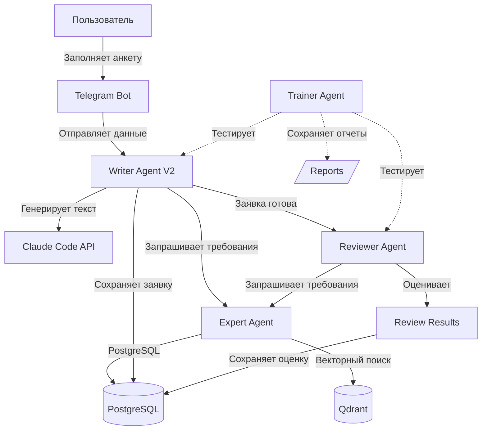

# GrantService - Архитектура системы

**Дата обновления:** 2025-10-17
**Версия:** 1.0 MVP
**Статус:** В разработке ✅

---

## 📋 Оглавление

1. [Обзор системы](#обзор-системы)
2. [Архитектура агентов](#архитектура-агентов)
3. [База данных и хранилище знаний](#база-данных-и-хранилище-знаний)
4. [Текущее состояние](#текущее-состояние)
5. [Технологический стек](#технологический-стек)
6. [Файловая структура](#файловая-структура)

---

## 🎯 Обзор системы

GrantService - это AI-платформа для автоматизации создания грантовых заявок с использованием Claude Code AI и векторной базы данных с требованиями фондов.

### Ключевые возможности

- ✅ **Автоматическая генерация заявок** - Writer Agent создает профессиональные заявки на гранты
- ✅ **Экспертная проверка** - Reviewer Agent оценивает готовность заявки к подаче
- ✅ **База знаний ФПГ** - Expert Agent с векторным поиском по требованиям Фонда президентских грантов
- ✅ **Автоматизированное тестирование** - Trainer Agent проверяет функциональность всех агентов
- 🚧 **Telegram бот** - интерфейс для пользователей (в разработке)
- 🚧 **Web Admin** - панель управления (в разработке)

---

## 🤖 Архитектура агентов

### 1. Expert Agent (Центр знаний) ✅

**Статус:** Работает
**Файл:** `expert_agent/expert_agent.py`

**Назначение:**
- Центральный агент-эксперт по грантам
- Хранит требования ФПГ (Фонд президентских грантов)
- Предоставляет релевантную информацию другим агентам

**Технологии:**
- PostgreSQL 18.0 - структурированные данные
- Qdrant (Docker) - векторные embeddings
- Sentence Transformers - multilingual-MiniLM-L12-v2

**API методы:**
```python
query_knowledge(question, fund="fpg", top_k=5, min_score=0.5)
add_knowledge_section(source_id, section_type, content)
get_statistics()
```

**База данных:**
- `knowledge_sources` - источники информации (требования ФПГ, регламенты)
- `knowledge_sections` - разделы знаний (embeddings → Qdrant)
- `evaluation_criteria` - критерии оценки заявок
- `successful_grant_examples` - успешные примеры

---

### 2. Writer Agent V2 (Генератор заявок) ✅

**Статус:** Работает
**Файл:** `agents/writer_agent_v2.py`

**Назначение:**
- Генерирует грантовые заявки на основе анкеты пользователя
- Использует требования из Expert Agent
- Создает 9 разделов заявки с цитатами и таблицами

**Интеграции:**
- ✅ Expert Agent - получение требований ФПГ
- ✅ Claude Code API - генерация текста
- ✅ PostgreSQL - сохранение заявок

**Процесс генерации:**
1. **Stage 1: Планирование** (Claude Code)
   - Создание плана заявки на основе требований Expert Agent
2. **Stage 2: Написание** (Claude Code)
   - Генерация всех 9 разделов с цитатами и таблицами

**Результат:**
```python
{
  'status': 'success',
  'application_number': '#AN-20251017-001',
  'quality_score': 7.0,  # из 10
  'citations': [...],     # 6+ цитат
  'tables': [...],        # 2+ таблицы
  'application': {
    'section_1_brief': '...',
    'section_2_problem': '...',
    ...
  }
}
```

**Тест результаты:**
- ✅ 16,306 символов текста
- ✅ 9 разделов
- ✅ 6 цитат из требований ФПГ
- ✅ ~2 минуты генерации
- ❌ Не сохраняется в БД (проблема с полем `title`)

---

### 3. Reviewer Agent (Оценщик качества) ✅

**Статус:** Работает
**Файл:** `agents/reviewer_agent.py`

**Назначение:**
- Оценивает готовность заявки к подаче
- Анализирует 4 критерия с весами
- Рассчитывает вероятность одобрения

**Интеграции:**
- ✅ Expert Agent - получение требований ФПГ для оценки
- ✅ Claude Code API - анализ (опционально)

**4 критерия оценки:**

| Критерий | Вес | Что проверяет |
|----------|-----|---------------|
| **Evidence Base** | 40% | Доказательная база: цитаты (10+), таблицы (2+), госпрограммы, успешные кейсы |
| **Structure** | 30% | Структура и полнота: 6 разделов, объем (15,000+ символов), детальность |
| **Matching** | 20% | Индикаторный матчинг: SMART-цели, измеримые KPI, региональная привязка |
| **Economics** | 10% | Экономика: бюджет, детальность, устойчивость, эффективность |

**Формула оценки:**
```python
readiness_score = (
    evidence * 0.40 +
    structure * 0.30 +
    matching * 0.20 +
    economics * 0.10
)  # 0-10

approval_probability = 15 + (readiness_score * 4.375)  # 0-100%
```

**Результат:**
```python
{
  'status': 'success',
  'readiness_score': 6.4,        # из 10
  'approval_probability': 43.0,  # %
  'can_submit': False,            # порог 7.0
  'quality_tier': 'Acceptable',
  'fpg_requirements': {...},      # 12 требований из векторной БД
  'criteria_scores': {...},
  'strengths': [...],
  'weaknesses': [...],
  'recommendations': [...]
}
```

**Тест результаты (на mock данных):**
- ✅ Readiness: 6.4/10
- ✅ Approval: 43%
- ✅ 12 требований из векторной БД загружены
- ✅ ~27 секунд выполнения
- ❌ Review не сохраняется в БД (нужно вызывать `review_and_save_grant_async`)

---

### 4. Trainer Agent (Тестировщик) ✅

**Статус:** Работает
**Файл:** `agents/trainer_agent/trainer_agent.py`

**Назначение:**
- Автоматически тестирует функциональность агентов
- Генерирует тестовые данные
- Сохраняет отчеты в JSON

**Методы:**
```python
# Тест Writer Agent
test_writer_functionality(test_case, use_real_llm=True)

# Тест Reviewer Agent
test_reviewer_functionality(test_case, use_real_llm=True)
```

**6 проверок для каждого агента:**
1. ✅ Инициализация агента
2. ✅ Подключение Expert Agent
3. ✅ Выполнение основной функции
4. ✅ Валидность результата
5. ⚠️ Сохранение в БД (проблемы)
6. ✅ Время выполнения

**Отчеты сохраняются:**
- `agents/trainer_agent/reports/TR-YYYYMMDD-HHMMSS.json`
- Копируются в `Project_workflow/05-Reports/`

---

## 🗄️ База данных и хранилище знаний

### PostgreSQL 18.0 (localhost:5432)

**Основные таблицы:**

| Таблица | Назначение | Статус |
|---------|-----------|--------|
| `knowledge_sources` | Источники требований ФПГ | ✅ Заполнена |
| `knowledge_sections` | Разделы знаний (48+ записей) | ✅ Заполнена |
| `evaluation_criteria` | Критерии оценки заявок | ✅ Заполнена |
| `successful_grant_examples` | Примеры успешных заявок | ✅ Заполнена |
| `grant_applications` | Грантовые заявки | ⚠️ Проблема с `title` |
| `reviewer_reviews` | Оценки от Reviewer Agent | 🚧 Не используется |
| `researcher_research` | Результаты исследований | ✅ Работает |

**Проблемы:**
- ❌ Writer Agent: не сохраняет заявки (поле `title` NULL)
- ❌ Reviewer Agent: не сохраняет reviews (вызывается `review_grant_async` вместо `review_and_save_grant_async`)

---

### Qdrant (Docker, localhost:6333)

**Коллекция:** `knowledge_sections`

**Статистика:**
- Векторов: 48+
- Размерность: 384 (multilingual-MiniLM-L12-v2)
- Метрика: Cosine similarity
- Минимальный score: 0.4-0.5

**Примеры запросов:**
```python
# Reviewer Agent
expert_agent.query_knowledge(
    "Какие требования к доказательной базе в грантовой заявке?",
    fund="fpg",
    top_k=3,
    min_score=0.4
)
# → 3 релевантных раздела с score 0.4-0.8
```

---

## 📊 Текущее состояние

### ✅ Что работает (5/6 тестов passed)

1. **Expert Agent** - полностью работает
   - PostgreSQL + Qdrant интеграция
   - Векторный поиск с embeddings
   - 48+ разделов требований ФПГ

2. **Writer Agent V2** - работает с проблемами
   - Генерирует заявки (~16,000 символов)
   - Использует Expert Agent
   - Claude Code API интеграция
   - ❌ Не сохраняет в БД

3. **Reviewer Agent** - работает с проблемами
   - Оценивает заявки по 4 критериям
   - Загружает 12 требований из векторной БД
   - Рассчитывает readiness score и approval probability
   - ❌ Не сохраняет reviews в БД

4. **Trainer Agent** - полностью работает
   - Тестирует Writer и Reviewer
   - Генерирует отчеты в JSON
   - 6 функциональных проверок

### ⚠️ Известные проблемы

1. **Writer Agent DB Save** (критично)
   ```
   ERROR: значение NULL в столбце "title" нарушает ограничение NOT NULL
   ```
   - Нужно добавить поле `title` при сохранении

2. **Reviewer Agent DB Save** (критично)
   - Trainer вызывает `review_grant_async()` вместо `review_and_save_grant_async()`
   - Reviews не сохраняются в таблицу `reviewer_reviews`

3. **Низкие оценки от Reviewer** (требует анализа)
   - Readiness: 6.4/10 (порог 7.0)
   - Matching: 3.0/10 - нет измеримых KPI
   - Economics: 2.5/10 - мало деталей в бюджете
   - **ВАЖНО:** Оценивались mock данные, не реальная заявка!

### 🎯 Следующие шаги

1. **Исправить сохранение в БД** (критично)
   - Writer: добавить `title` field
   - Reviewer: использовать `review_and_save_grant_async()`

2. **Протестировать реальный пайплайн** Writer → Reviewer
   - Сгенерировать РЕАЛЬНУЮ заявку через Writer
   - Оценить её через Reviewer
   - Проанализировать результаты

3. **Улучшить Writer Agent** (если нужно)
   - Добавить генерацию измеримых KPI
   - Детализировать экономическое обоснование
   - Увеличить объем до 15,000+ символов

4. **Создать итеративный цикл** Writer ↔ Reviewer
   - Writer генерирует заявку
   - Reviewer оценивает и дает рекомендации
   - Writer улучшает заявку на основе рекомендаций
   - Повторить до readiness >= 7.0

---

## 💻 Технологический стек

### Backend
- **Python 3.12**
- **PostgreSQL 18.0** - основная БД
- **Qdrant** (Docker) - векторная БД
- **Sentence Transformers** - embeddings

### AI/ML
- **Claude Code API** - генерация текста (Writer Agent)
- **multilingual-MiniLM-L12-v2** - векторные embeddings

### Frontend (в разработке)
- **Telegram Bot** - основной интерфейс
- **Web Admin (React)** - административная панель

---

## 📁 Файловая структура

```
GrantService/
├── Project_workflow/                # Управление проектом
│   ├── 00-Architecture/            # Архитектурная документация
│   ├── 01-Stages/                  # Этапы разработки
│   │   ├── 2025-10-17_Expert-Agent-Architecture/
│   │   └── 2025-10-17_Trainer-Agent-Architecture/
│   ├── 02-Sessions/                # Сессии работы
│   │   └── 2025-10-17_Writer-Expert-Integration.md
│   ├── 03-Tests/                   # Результаты тестов
│   ├── 04-Documentation/           # Документация
│   ├── 05-Reports/                 # Отчеты Trainer Agent
│   │   ├── TR-20251017-143104.json (Writer test)
│   │   └── TR-20251017-150349.json (Reviewer test)
│   ├── ARCHITECTURE.md             # Этот файл
│   ├── STATUS.md                   # Текущий статус (TODO)
│   └── ROADMAP.md                  # План развития (TODO)
│
├── agents/                          # AI Агенты
│   ├── writer_agent_v2.py          # ✅ Генератор заявок
│   ├── reviewer_agent.py           # ✅ Оценщик качества
│   ├── interviewer_agent.py        # 🚧 Интервьюер
│   ├── researcher_agent_v2.py      # 🚧 Исследователь
│   └── trainer_agent/              # ✅ Тестировщик
│       ├── trainer_agent.py
│       └── reports/
│
├── expert_agent/                    # Expert Agent (векторная БД)
│   ├── expert_agent.py             # ✅ Центр знаний
│   └── migrations/                 # Миграции БД
│       └── seed_knowledge_base.py  # ✅ Заполнение базы
│
├── data/database/                   # База данных
│   ├── models.py                   # ✅ Модели БД
│   └── schema.sql                  # ✅ Схема
│
├── run_trainer_test_REAL.py        # ✅ Тест Writer Agent
├── run_trainer_test_reviewer.py    # ✅ Тест Reviewer Agent
│
├── telegram-bot/                    # 🚧 Telegram интерфейс
├── web-admin/                       # 🚧 Web панель
└── config/                          # Конфигурация
    └── .env                         # API ключи, БД
```

---

## 🔗 Связи между компонентами



---

## 📝 История изменений

### 2025-10-17 - Initial Architecture Document
- Создана базовая архитектурная документация
- Зафиксировано текущее состояние (5/6 тестов passed)
- Выявлены проблемы с сохранением в БД
- Определены следующие шаги

---

**Последнее обновление:** 2025-10-17 15:20
**Автор:** Andrey (с помощью Claude Code)
**Версия:** 1.0 MVP
