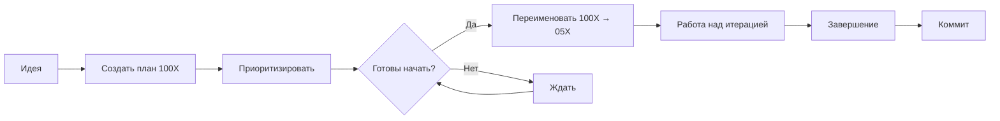

# Система планирования итераций GrantService

**Дата создания:** 2025-10-26
**Статус:** Активная

---

## 🎯 Концепция

Мы используем **двойную нумерацию** для итераций:

### Текущие итерации (выполненные/в работе)
```
Iteration_001_*
Iteration_002_*
...
Iteration_051_AI_Enhancement ✅ COMPLETE
Iteration_052_* (следующая)
```

### Будущие итерации (планы)
```
Iteration_1001_RAG_Full_Integration     📅 PLANNED
Iteration_1002_E2E_Tests_Complete       📅 PLANNED (HIGH PRIORITY)
Iteration_1003_*                        📅 PLANNED
...
```

---

## 📋 Как это работает

### 1️⃣ Создание плана
Когда появляется идея для новой итерации:
```bash
# Создаем папку с номером 100X
mkdir iterations/Iteration_100X_Feature_Name/

# Создаем план
touch iterations/Iteration_100X_Feature_Name/00_PLAN.md
```

### 2️⃣ Начало работы
Когда начинаем работать над итерацией:
```bash
# Переименовываем 100X → следующий порядковый номер
mv iterations/Iteration_1001_* iterations/Iteration_053_RAG_Full_Integration/

# Обновляем STATUS.md
echo "Status: 🚧 IN PROGRESS" >> STATUS.md
```

### 3️⃣ Завершение итерации
```bash
# Обновляем статус
echo "Status: ✅ COMPLETE" >> STATUS.md

# Коммитим
git add .
git commit -m "feat(iteration-053): COMPLETE - RAG Full Integration"
```

---

## 📊 Текущий статус

### Выполненные итерации: 51
```
Iteration_001 - Iteration_051 ✅ DONE
```

### Следующая итерация: 52 или 53
```
Iteration_052_* (ожидает начала)
```

### Запланированные итерации: 2

| № | Название | Приоритет | Время | Статус |
|---|----------|-----------|-------|--------|
| **1001** | RAG Full Integration | MEDIUM | 4-6h | 📅 PLANNED |
| **1002** | E2E Tests Complete | 🔥 HIGH | 6-8h | 📅 PLANNED |

---

## 🎯 Приоритизация

### Система приоритетов:
- 🔥 **HIGH** - критично, делаем первым
- 🟡 **MEDIUM** - важно, но может подождать
- 🔵 **LOW** - nice to have

### Текущие приоритеты:
1. **Iteration_1002** - E2E Tests Complete (🔥 HIGH)
2. **Iteration_1001** - RAG Full Integration (🟡 MEDIUM)

---

## 📝 Правила

### ✅ DO:
- Создавайте планы заранее (1001, 1002, 1003...)
- Указывайте приоритет в плане
- Оценивайте время выполнения
- Переименовывайте только при **начале** работы
- Документируйте результаты в SUMMARY.md

### ❌ DON'T:
- Не удаляйте планы без причины
- Не начинайте без плана
- Не пропускайте порядковые номера (51 → 52 → 53, не 51 → 55)
- Не меняйте номер во время работы

---

## 📂 Структура папки итерации

### Минимальный набор:
```
Iteration_XXXX_Name/
├── 00_PLAN.md                  # План (обязательно)
├── STATUS.md                   # Статус (создается при начале)
└── SUMMARY.md                  # Итоги (создается при завершении)
```

### Полный набор (пример):
```
Iteration_051_AI_Enhancement/
├── 00_ITERATION_PLAN.md        # Детальный план
├── STATUS.md                   # Живой статус
├── ITERATION_51_FINAL_SUMMARY.md  # Финальный отчет
├── RAG_DESIGN.md               # Техническая документация
├── test_writer_rag.py          # Тестовые скрипты
├── fpg_real_winners_dataset.json  # Данные
├── fpg_requirements_dataset.json
└── ... (другие артефакты)
```

---

## 🔄 Workflow



---

## 📖 Примеры

### Пример 1: Создание нового плана
```bash
# Идея: Добавить экспорт в Word
mkdir iterations/Iteration_1003_Word_Export/
cat > iterations/Iteration_1003_Word_Export/00_PLAN.md << EOF
# Iteration 1003: Word Export

**Goal:** Add Word export functionality for grant applications

**Estimated Time:** 3-4 hours
**Priority:** LOW
EOF
```

### Пример 2: Начало работы
```bash
# Решили начать работу над 1002 (E2E Tests)
# Текущая итерация: 51
# Следующая должна быть: 52

# Переименовываем
mv iterations/Iteration_1002_E2E_Tests_Complete/ \
   iterations/Iteration_052_E2E_Tests_Complete/

# Обновляем STATUS.md
echo "Status: 🚧 IN PROGRESS" >> iterations/Iteration_052_E2E_Tests_Complete/STATUS.md
```

### Пример 3: Множество планов
```bash
# У нас 5 идей:
iterations/Iteration_1001_RAG_Full_Integration/      # MEDIUM priority
iterations/Iteration_1002_E2E_Tests_Complete/        # HIGH priority
iterations/Iteration_1003_Word_Export/               # LOW priority
iterations/Iteration_1004_Multi_Language_Support/    # MEDIUM priority
iterations/Iteration_1005_Analytics_Dashboard/       # LOW priority

# Начинаем с HIGH priority:
# 1002 → 052 (работаем)
# Остальные ждут своей очереди
```

---

## 🎓 Преимущества системы

### ✅ Плюсы:
1. **Планирование заранее** - видим будущие задачи
2. **Приоритизация** - знаем, что делать следующим
3. **Гибкость** - можем менять порядок
4. **История** - все итерации пронумерованы
5. **Чистота** - нет пропусков в номерах

### 📈 Метрики:
- Средняя длительность итерации: 1-2 дня
- Количество итераций: 51 выполнено
- Успешность: 100% (все завершенные итерации задокументированы)

---

## 🔗 Ссылки

- **Последняя завершенная:** [Iteration_051_AI_Enhancement](./Iteration_051_AI_Enhancement/)
- **Следующая по плану:** [Iteration_1002_E2E_Tests_Complete](./Iteration_1002_E2E_Tests_Complete/)
- **Альтернативная:** [Iteration_1001_RAG_Full_Integration](./Iteration_1001_RAG_Full_Integration/)

---

## ❓ FAQ

**Q: Почему 1001, а не 101?**
A: Чтобы избежать путаницы. 1001 явно показывает, что это план, не выполненная итерация.

**Q: Можно удалить план 100X, если он не актуален?**
A: Да, но лучше пометить как CANCELLED и оставить для истории.

**Q: Что если начали 1002, а потом решили начать 1001?**
A: Тогда 1002 станет 052, 1001 станет 053 (кто начался первым, тот и меньший номер).

**Q: Можно ли работать над 2 итерациями параллельно?**
A: Технически да, но не рекомендуется. Лучше фокус на одной.

---

**Система создана:** 2025-10-26
**Автор:** Claude Code
**Статус:** 🟢 ACTIVE
