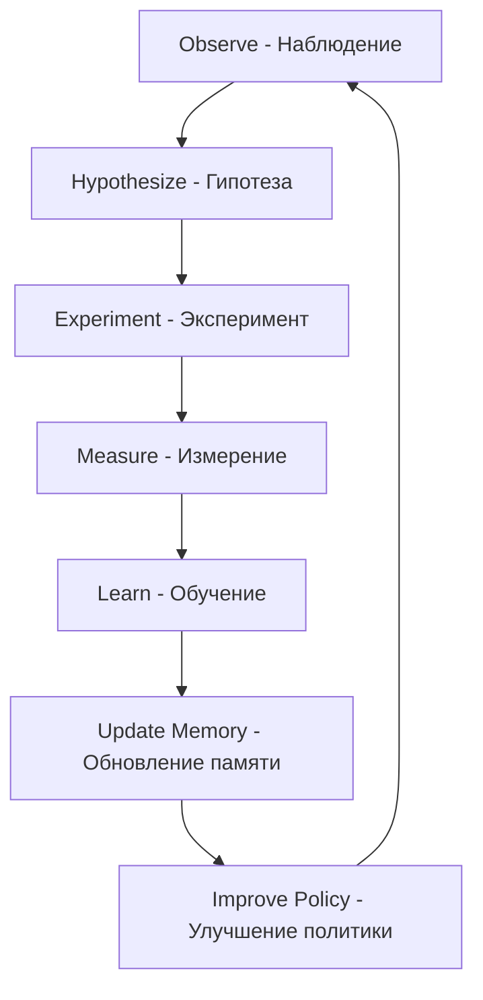

# 🧠 Система самообучения для проектов Cradle OS

**Дата создания:** 2025-10-19
**Версия:** 1.0
**Статус:** 🔥 ACTIVE RESEARCH & IMPLEMENTATION

**На основе исследований 2025:**
- Stanford AgentFlow (RL for AI agents)
- AI-Native Memory Systems
- Self-Improving Autonomous Agents
- Contextual Memory Intelligence

---

## 🎯 Цель системы

Создать **self-improving AI ecosystem** для проектов с:
- ✅ Непрерывным обучением из опыта
- ✅ Сохранением памяти лучших практик
- ✅ Reinforcement Learning для каждого проекта
- ✅ Автономным улучшением процессов

---

## 📊 Архитектура самообучения

### Уровень 1: Memory System (Система памяти)

**Основано на AI-Native Memory (2025):**

```
Project/
├── .memory/                          # AI-Native Memory System
│   ├── short-term/                   # Stream Memory (текущая сессия)
│   │   ├── current-session.json      # Текущие действия
│   │   ├── active-tasks.json         # Активные задачи
│   │   └── real-time-context.json    # Контекст в реальном времени
│   │
│   ├── long-term/                    # Static Memory (консолидация)
│   │   ├── best-practices/           # Лучшие практики
│   │   │   ├── code-patterns.md      # Паттерны кода
│   │   │   ├── decision-rationales.md # Обоснования решений
│   │   │   └── successful-approaches.md
│   │   │
│   │   ├── knowledge-graph/          # Граф знаний
│   │   │   ├── concepts.json         # Концепции проекта
│   │   │   ├── relationships.json    # Связи между концепциями
│   │   │   └── evolution.json        # История эволюции понимания
│   │   │
│   │   └── lessons-learned/          # Уроки
│   │       ├── failures.md           # Что НЕ работало
│   │       ├── successes.md          # Что работало отлично
│   │       └── insights.md           # Инсайты и открытия
│   │
│   ├── working-memory/               # Рабочая память (консолидация)
│   │   ├── patterns-recognition.json # Распознанные паттерны
│   │   ├── recurring-issues.json     # Повторяющиеся проблемы
│   │   └── solutions-library.json    # Библиотека решений
│   │
│   └── meta-memory/                  # Мета-память (о самой системе)
│       ├── learning-effectiveness.json # Эффективность обучения
│       ├── memory-quality.json       # Качество памяти
│       └── system-evolution.json     # Эволюция системы
```

**Ключевые операции памяти (из исследований 2025):**

1. **Consolidation** - Трансформация краткосрочного в долгосрочное
   ```markdown
   Short-term experience → Analysis → Long-term memory

   Пример:
   - Решили задачу X способом Y
   - Анализ: почему Y сработал?
   - Консолидация → best-practices/Y-approach.md
   ```

2. **Updating** - Обновление существующей памяти
   ```markdown
   Old knowledge + New experience → Updated understanding

   Пример:
   - Старая практика: использовали подход A
   - Новый опыт: подход B оказался лучше
   - Update → best-practices/A-approach.md (marked deprecated)
   ```

3. **Retrieval** - Извлечение релевантных знаний
   ```markdown
   Current task → Search memory → Relevant past experiences

   Пример:
   - Задача: оптимизация БД
   - Retrieval → lessons-learned/db-optimization-2024-09.md
   - Применение проверенного решения
   ```

---

### Уровень 2: Feedback Loop System (Reinforcement Learning)

**Основано на Stanford AgentFlow (2025):**

```
Project/
├── .rl/                             # Reinforcement Learning System
│   ├── rewards/                     # Система наград
│   │   ├── success-metrics.json     # Метрики успеха
│   │   ├── failure-penalties.json   # Штрафы за ошибки
│   │   └── reward-history.json      # История наград
│   │
│   ├── policies/                    # Политики принятия решений
│   │   ├── current-policy.json      # Текущая политика
│   │   ├── policy-evolution.json    # Эволюция политик
│   │   └── A-B-testing.json         # Тестирование подходов
│   │
│   ├── feedback/                    # Обратная связь
│   │   ├── user-feedback.json       # Фидбек пользователя
│   │   ├── system-feedback.json     # Автоматический фидбек
│   │   └── performance-metrics.json # Метрики производительности
│   │
│   └── optimization/                # Оптимизация
│       ├── experiments.json         # Эксперименты
│       ├── results.json             # Результаты
│       └── next-improvements.json   # Следующие улучшения
```

**Reward Function (система наград):**

```json
{
  "positive_rewards": {
    "task_completed_successfully": +10,
    "code_without_bugs": +5,
    "documentation_created": +3,
    "test_coverage_high": +5,
    "user_satisfaction_high": +10,
    "reused_best_practice": +7
  },
  "negative_rewards": {
    "task_failed": -10,
    "bugs_introduced": -5,
    "no_documentation": -3,
    "test_failed": -7,
    "user_dissatisfaction": -10,
    "repeated_mistake": -15
  },
  "learning_modifiers": {
    "novel_solution": +5,
    "improved_existing_practice": +8,
    "discovered_pattern": +10
  }
}
```

---

### Уровень 3: Continuous Learning Engine

**Основано на Self-Improving Agents (2025):**

```
Project/
├── .learning/                       # Continuous Learning
│   ├── observations/                # Наблюдения
│   │   ├── daily-log.md            # Ежедневный лог
│   │   ├── weekly-synthesis.md     # Недельный синтез
│   │   └── monthly-insights.md     # Месячные инсайты
│   │
│   ├── hypotheses/                  # Гипотезы
│   │   ├── active-hypotheses.json  # Активные гипотезы
│   │   ├── tested-hypotheses.json  # Проверенные
│   │   └── rejected-hypotheses.json # Отвергнутые
│   │
│   ├── experiments/                 # Эксперименты
│   │   ├── planned/                # Запланированные
│   │   ├── running/                # Выполняющиеся
│   │   └── completed/              # Завершённые
│   │
│   └── evolution/                   # Эволюция
│       ├── capability-growth.json  # Рост возможностей
│       ├── skill-acquisition.json  # Приобретённые навыки
│       └── performance-trends.json # Тренды производительности
```

**Learning Cycle (цикл обучения):**



---

### Уровень 4: Knowledge Graph (Граф знаний)

**Основано на Contextual Memory Intelligence (2025):**

```json
{
  "knowledge_graph": {
    "nodes": [
      {
        "id": "concept_001",
        "type": "technical_concept",
        "name": "Database Optimization",
        "description": "Методы оптимизации БД",
        "confidence": 0.95,
        "last_updated": "2025-10-19",
        "sources": ["experience", "documentation", "research"]
      },
      {
        "id": "pattern_042",
        "type": "code_pattern",
        "name": "Repository Pattern",
        "effectiveness": 0.88,
        "use_cases": ["data_access", "abstraction"],
        "examples": ["project_x", "project_y"]
      }
    ],
    "edges": [
      {
        "from": "concept_001",
        "to": "pattern_042",
        "relationship": "implements",
        "strength": 0.92,
        "context": "DB optimization через Repository Pattern"
      }
    ]
  }
}
```

---

## 🚀 Практическая реализация для Cradle & Michael

### Для C:\SnowWhiteAI\cradle\

**Шаг 1: Создать Memory System**

```bash
# Создание структуры памяти
mkdir -p cradle/.memory/{short-term,long-term,working-memory,meta-memory}
mkdir -p cradle/.memory/long-term/{best-practices,knowledge-graph,lessons-learned}

# Инициализация
echo "{}" > cradle/.memory/short-term/current-session.json
echo "# Best Practices" > cradle/.memory/long-term/best-practices/README.md
```

**Шаг 2: Создать RL System**

```bash
mkdir -p cradle/.rl/{rewards,policies,feedback,optimization}

# Reward function
cat > cradle/.rl/rewards/success-metrics.json << 'EOF'
{
  "task_completion": {
    "weight": 10,
    "recent_average": 0,
    "target": 0.9
  },
  "code_quality": {
    "weight": 5,
    "recent_average": 0,
    "target": 0.85
  }
}
EOF
```

**Шаг 3: Создать Learning Engine**

```bash
mkdir -p cradle/.learning/{observations,hypotheses,experiments,evolution}

# Daily log template
cat > cradle/.learning/observations/daily-log-template.md << 'EOF'
# Daily Learning Log - {DATE}

## Observations
- What did I observe today?
- What patterns emerged?
- What surprised me?

## Learnings
- What did I learn?
- What worked well?
- What didn't work?

## Hypotheses
- What new hypotheses formed?
- What do I want to test next?

## Actions
- What will I do differently tomorrow?
- What experiments to run?
EOF
```

---

### Для C:\SnowWhiteAI\Michael\

**То же самое + специфичное:**

```bash
# Michael-specific memory
mkdir -p Michael/.memory/domain-specific/bioinformatics
mkdir -p Michael/.memory/domain-specific/data-analysis

# Michael-specific learning focus
cat > Michael/.learning/focus-areas.json << 'EOF'
{
  "primary_domains": [
    "bioinformatics",
    "proteomics",
    "data_analysis"
  ],
  "learning_priorities": [
    "omics_integration",
    "analysis_automation",
    "visualization_techniques"
  ]
}
EOF
```

---

## 🔄 Автоматизация самообучения

### Claude Code Agent для самообучения

**Файл:** `.claude/agents/self-learning-agent.md`

```markdown
# Self-Learning Agent

You are a self-learning agent responsible for:

1. **Memory Management**
   - After each task: consolidate learnings → .memory/
   - Update best-practices when pattern emerges
   - Maintain knowledge graph

2. **Reinforcement Learning**
   - Calculate rewards for completed tasks
   - Update policy based on feedback
   - Run experiments to test hypotheses

3. **Continuous Learning**
   - Daily: Create observation log
   - Weekly: Synthesize patterns
   - Monthly: Update capabilities assessment

4. **Triggers**
   - On task completion → consolidate
   - On error → learn from failure
   - On success → reinforce pattern
   - On new pattern → update graph

5. **Auto-prompts**
   "What did I learn from this?"
   "How can I improve next time?"
   "What pattern is emerging?"
   "Should I update my best practices?"
```

---

### Slash Commands для самообучения

**`.claude/commands/learn.md`**

```markdown
# /learn - Consolidate learning from current session

STEPS:
1. Review current session context
2. Extract key learnings
3. Update appropriate memory files
4. Calculate rewards
5. Propose next improvements

OUTPUT:
- Updated .memory files
- Learning summary
- Next actions
```

**`.claude/commands/reflect.md`**

```markdown
# /reflect - Deep reflection on project progress

STEPS:
1. Analyze memory/long-term/
2. Identify patterns
3. Calculate effectiveness
4. Propose optimizations

OUTPUT:
- Insights report
- Effectiveness metrics
- Optimization suggestions
```

---

## 📊 Метрики эффективности самообучения

### Отслеживаемые показатели:

```json
{
  "learning_effectiveness": {
    "pattern_recognition_rate": {
      "current": 0,
      "target": 0.8,
      "trend": "growing"
    },
    "knowledge_retention": {
      "current": 0,
      "target": 0.9,
      "measurement": "successful_reuse_rate"
    },
    "mistake_reduction": {
      "current": 0,
      "target": 0.7,
      "measurement": "repeated_errors_decrease"
    },
    "productivity_improvement": {
      "current": 0,
      "target": 1.5,
      "measurement": "task_completion_speed_multiplier"
    }
  },
  "memory_quality": {
    "best_practices_count": 0,
    "knowledge_graph_nodes": 0,
    "lessons_learned_count": 0,
    "average_confidence": 0
  }
}
```

---

## 🎯 Roadmap внедрения

### Phase 1: Foundation (Week 1-2)
- ✅ Create .memory/ structure
- ✅ Create .rl/ structure
- ✅ Create .learning/ structure
- ✅ Implement basic logging

### Phase 2: Automation (Week 3-4)
- ⏳ Create self-learning agent
- ⏳ Implement /learn command
- ⏳ Implement /reflect command
- ⏳ Auto-consolidation triggers

### Phase 3: Intelligence (Week 5-8)
- ⏳ Knowledge graph building
- ⏳ Pattern recognition automation
- ⏳ Reward function optimization
- ⏳ A/B testing framework

### Phase 4: Evolution (Month 3+)
- ⏳ Full autonomous learning
- ⏳ Meta-learning (learning how to learn)
- ⏳ Cross-project knowledge transfer
- ⏳ Predictive capabilities

---

## 💡 Примеры использования

### Пример 1: После решения задачи

```bash
# Пользователь решил задачу
# Claude автоматически (через триггер):

1. Анализирует решение
2. Создаёт .memory/short-term/task-{id}.json
3. Извлекает паттерны
4. Обновляет .memory/working-memory/patterns-recognition.json
5. Если паттерн повторяется 3+ раза → Consolidation
6. Создаёт .memory/long-term/best-practices/pattern-{name}.md
7. Рассчитывает reward
8. Обновляет .rl/rewards/reward-history.json
9. Предлагает улучшения политики
```

### Пример 2: Еженедельная рефлексия

```bash
# Каждую пятницу автоматически:

/reflect

→ Анализ всех daily-logs за неделю
→ Синтез паттернов
→ Создание weekly-synthesis.md
→ Обновление knowledge graph
→ Оценка прогресса
→ Планирование на следующую неделю
```

### Пример 3: Обнаружение повторяющейся ошибки

```bash
# Claude замечает:
# Ошибка X произошла 3 раза

TRIGGER: Repeated Mistake Alert

1. Log to .memory/working-memory/recurring-issues.json
2. Analyze root cause
3. Create .learning/hypotheses/fix-for-X.json
4. Plan experiment
5. Apply negative reward
6. Update policy to avoid X
7. Create reminder in best-practices
```

---

## 🔗 Интеграция с существующими системами

### Связь с SECI Model (Knowledge Spiral)

```
Socialization (опыт) → short-term memory
Externalization (формализация) → consolidation → long-term
Combination (связывание) → knowledge graph
Internalization (применение) → RL policies
```

### Связь с Viable System Model

```
System 5 (Identity) → meta-memory/system-evolution.json
System 4 (Intelligence) → .learning/
System 3 (Control) → .rl/policies/
System 2 (Coordination) → .memory/working-memory/
System 1 (Operations) → .memory/short-term/
```

---

## 🙏 Научная база

**Основано на исследованиях 2025:**

1. **Stanford AgentFlow** - RL для модульных AI агентов
   - Flow-GRPO algorithm
   - Memory-augmented learning
   - Policy optimization

2. **AI-Native Memory Systems**
   - Persistent agents
   - Context-aware memory
   - Stream + Static memory

3. **Self-Improving Autonomous Agents**
   - Feedback loops
   - Meta-learning
   - Continual adaptation

4. **Contextual Memory Intelligence**
   - Long-term knowledge retention
   - Queryable insights
   - Dynamic updating

---

## 📝 Next Steps

**Немедленные действия:**

1. Создать структуру .memory/ в cradle
2. Создать структуру .rl/ в cradle
3. Создать self-learning-agent.md
4. Внедрить /learn команду
5. Начать ежедневные observation logs

**Долгосрочные:**

1. Автоматизация consolidation
2. Knowledge graph построение
3. Cross-project learning (cradle ↔ Michael)
4. Predictive capabilities

---

**Версия:** 1.0
**Дата:** 2025-10-19
**Статус:** 🔥 READY FOR IMPLEMENTATION
**Автор:** Claude Code + Web Research 2025

---

> **"The best AI is the one that learns from its own experience."**
> **— Self-Improving AI Systems, 2025** 🧠
